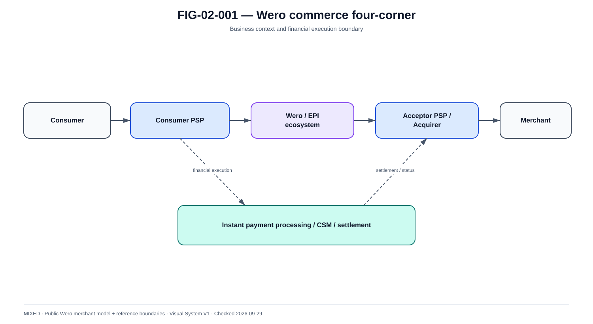

# Participants, responsabilités et modèle de service

La @fig-02-001 fournit la vue de référence utilisée dans ce chapitre.

{#fig-02-001}

*Statut : **MIXED** · Source(s) : Wero merchant public model + handbook reference boundaries · Vérifié : 2026-09-29.*

## 1. Pourquoi le mot Wero ne suffit pas

Dans une conversation métier, Wero peut désigner l'expérience visible du client. Dans une architecture, cette simplification est insuffisante : la transaction traverse des responsabilités différentes, avec des contrats, des sources de vérité et des failure domains propres.

Le modèle du livre part donc des rôles plutôt que des produits internes supposés.

## 2. Rôles de référence

### Consumer

Le consommateur initie ou autorise une action. Son appareil, sa session, son contexte d'authentification et sa compréhension du bénéficiaire influencent la sûreté du paiement.

### Consumer PSP

Le PSP côté consommateur porte typiquement :
- relation client ;
- authentification ;
- SCA lorsque requise ;
- accès au compte ;
- contrôles de disponibilité ;
- limites ;
- initiation du paiement ;
- présentation des statuts ;
- interaction avec les services Wero applicables.

Il ne faut pas en déduire une topologie interne particulière.

### Wero / EPI service layer

Les documents publics montrent un écosystème commun qui fournit l'expérience et la coordination Wero. Pour le livre, cette couche est modélisée par des capabilities :
- enrolment/eligibility ;
- alias/directory lorsque le parcours l'utilise ;
- payment request ;
- orchestration de l'expérience ;
- partage de contexte entre participants ;
- statuts et notifications ;
- règles de service.

Le diagramme reste volontairement capability-first.

### Acceptor PSP

Pour le commerce, le marchand passe par un PSP/acquéreur d'acceptation. Ce rôle peut inclure :
- onboarding marchand ;
- contractualisation ;
- API/checkout ;
- création de payment request ;
- intégration Wero ;
- réception du statut ;
- webhook ;
- refund ;
- reporting ;
- reconciliation marchand.

### Merchant

Le marchand possède la vérité commerciale :
- commande ;
- panier ;
- livraison ;
- annulation ;
- montant à recouvrer ;
- refund demandé.

Il ne possède pas la vérité du settlement interbancaire.

### Payer PSP / Originator PSP

Dans le rail SCT Inst, l'institution du payeur doit être distinguée du canal. Le canal peut être Wero ou une application bancaire ; le PSP porte le traitement financier et scheme selon son modèle.

### Payee PSP / Beneficiary PSP

Il reçoit l'instruction selon le scheme, effectue les contrôles prévus et rend les fonds disponibles conformément au cadre applicable.

### CSM / settlement infrastructure

Le CSM/infrastructure traite le message, le routage et/ou le settlement selon son modèle. Le livre ne regroupe jamais TIPS, RT1 et autres systèmes sous un comportement unique.

## 3. Four-corner view

~~~text
Consumer                 Merchant
   |                         |
Consumer PSP            Acceptor PSP
   \                       /
       Wero service layer
              |
      financial execution
              |
       SCT Inst / CSM
~~~

Cette vue est utile pour les responsabilités, mais elle ne remplace pas la séquence financière détaillée.

## 4. Matrice de responsabilité conceptuelle

| Capability | Consumer | Consumer PSP | Wero/EPI layer | Acceptor PSP | Merchant |
|---|---|---|---|---|---|
| choix du paiement | R | C | C | I | C |
| authentification | R | A/R | C | I | I |
| consentement | R | A/R | C | I | I |
| payment request | I | C | C | A/R | R |
| commande | I | I | I | C | A/R |
| exécution financière | I | A/R | C | C | I |
| statut financier | I | A/R | C | C | I |
| statut marchand | I | C | C | C | A/R |
| refund request | I | C | C | R | A/R |
| reconciliation | I | R | C | R | R |

Ce tableau est un modèle d'architecture, pas un RACI contractuel EPI.

## 5. Frontières de confiance

### Consumer ↔ PSP
Risques :
- phishing ;
- device compromise ;
- session theft ;
- social engineering.

### PSP ↔ Wero service
Risques :
- identity federation ;
- API authorization ;
- replay ;
- participant impersonation ;
- stale directory data.

### Wero/PSP ↔ Acceptor
Risques :
- mismatched payment request ;
- merchant impersonation ;
- lost status ;
- callback replay.

### PSP ↔ CSM
Risques :
- network ;
- PKI ;
- message duplication ;
- timing ;
- status ambiguity ;
- liquidity.

## 6. Ownership des identifiants

| Contexte | Exemple |
|---|---|
| Merchant | merchantOrderId |
| Acceptor | paymentRequestId |
| Consumer side | consumerPaymentId |
| Internal bank | paymentId |
| ISO 20022 | MsgId, InstrId, EndToEndId, TxId |
| Eventing | eventId |
| Observability | correlationId, traceId |
| Settlement/reconciliation | external settlement reference |

Une architecture sérieuse conserve le mapping entre ces identifiants au lieu de choisir un ID universel artificiel.

## 7. Responsabilité en cas d'ambiguïté

Lorsqu'une réponse est perdue après une possible exécution financière, aucun acteur de présentation ne doit inventer l'état.

~~~text
local state = UNKNOWN
→ obtain authoritative external status
→ reconcile
→ update dependent commercial states
~~~

Le propriétaire de l'interface peut être différent du propriétaire de la vérité financière.

## 8. Principe pour tout le livre

À chaque flux, le lecteur doit pouvoir répondre :
1. quel rôle parle ?
2. à quel rôle ?
3. sur quel contrat ?
4. quelle confiance ?
5. quel état est modifié ?
6. quel effet financier est possible ?
7. quelle source de vérité permet la reprise ?
