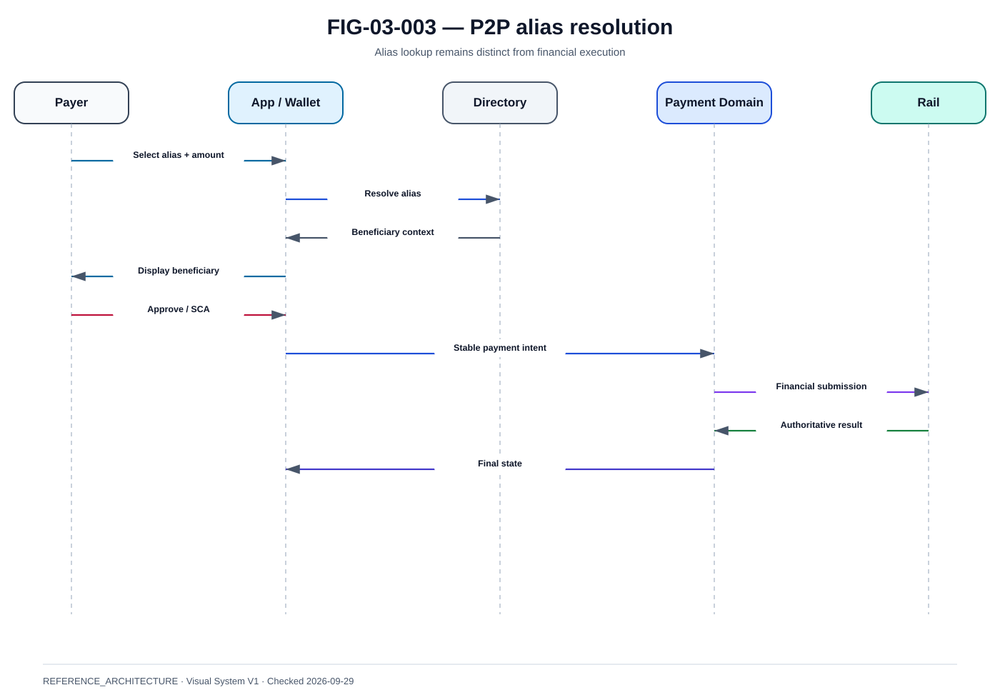

# P2P, alias et résolution de bénéficiaire

La @fig-03-003 fournit la vue de référence utilisée dans ce chapitre.

{#fig-03-003}

*Statut : **REFERENCE_ARCHITECTURE** · Source(s) : Handbook reference architecture · Vérifié : 2026-09-29.*

## 1. Le problème d'architecture

L'expérience P2P cherche à masquer l'IBAN derrière un identifiant plus humain. Cette simplification UX crée un domaine critique : le directory/alias.

## 2. Alias ≠ compte

Un alias peut être :
- numéro de téléphone ;
- e-mail ;
- identifiant de service ;
- autre clé prévue par le produit.

Il pointe vers un contexte permettant d'atteindre le bon bénéficiaire, mais ne doit pas être considéré comme le compte bancaire lui-même.

## 3. Lifecycle d'alias

~~~text
UNREGISTERED
→ VERIFIED
→ BOUND
→ ACTIVE
→ UPDATED
→ REVOKED
→ EXPIRED
~~~

Transitions sensibles :
- changement de banque ;
- changement de téléphone ;
- numéro réattribué ;
- compte fermé ;
- utilisateur décédé ;
- fraude.

## 4. Proof of possession

Avant de lier un alias, il faut vérifier que l'utilisateur possède ou contrôle l'identifiant selon le modèle du service.

Risques :
- SIM swap ;
- mailbox compromise ;
- stale verification ;
- recycled mobile number.

## 5. Directory lookup

Input :
- alias.

Output conceptuel :
- resolved party ;
- PSP route ;
- display data ;
- freshness ;
- eligibility.

Ne pas renvoyer plus de données que nécessaire.

## 6. Privacy

Un directory peut être abusé pour énumérer utilisateurs, noms ou institutions.

Protections :
- rate limits ;
- authentication ;
- response minimisation ;
- abuse detection ;
- audit.

## 7. P2P sequence

~~~text
Payer
→ enter/select alias
→ lookup
→ beneficiary display
→ verification context
→ amount
→ consent/SCA
→ stable payment intent
→ financial execution
→ authoritative result
→ notifications
~~~

## 8. Contact-book risk

Une application peut lire un carnet d'adresses, mais doit gérer :
- consentement OS ;
- privacy ;
- normalisation ;
- country code ;
- duplicate contacts ;
- stale contacts.

Le contact local et l'alias du service sont deux données différentes.

## 9. Name display

Le nom présenté au payeur doit réduire erreur et impersonation, mais ne devient pas l'identifiant technique du paiement.

## 10. Idempotence

Le double clic ou le retry d'un écran ne doit pas créer deux intents.

~~~text
payer + resolved beneficiary + amount + logical interaction
→ stable idempotency identity
~~~

La clé exacte dépend du produit, mais doit rester stable pendant la reprise.

## 11. Timeout

Si le paiement a été soumis et le statut final perdu :

~~~text
UI timeout
→ payment UNKNOWN
→ status recovery
→ final state
~~~

L'application ne doit pas inviter automatiquement à recommencer.

## 12. Notifications

Payeur :
- submitted/pending ;
- settled ;
- rejected ;
- investigating selon UX.

Bénéficiaire :
- notifier seulement sur un état suffisamment autoritatif.

## 13. P2P fraud

Patterns :
- account takeover ;
- APP/social engineering ;
- impersonation ;
- mule ;
- SIM swap ;
- beneficiary change.

Signals :
- new device ;
- new beneficiary ;
- amount anomaly ;
- velocity ;
- risky alias changes ;
- geo/device mismatch.

## 14. Directory resilience

Failure modes :
- lookup timeout ;
- stale mapping ;
- partition ;
- duplicate aliases ;
- inconsistent cache.

Safe behavior :
- stop avant paiement si l'identité ne peut pas être résolue de façon sûre ;
- ne jamais deviner la destination ;
- cacher uniquement avec une sémantique de fraîcheur explicite.

## 15. Reconciliation

Comparer :
- user-facing history ;
- internal ledger ;
- rail status ;
- beneficiary result.

Un bug de notification ne doit pas altérer la vérité financière.
