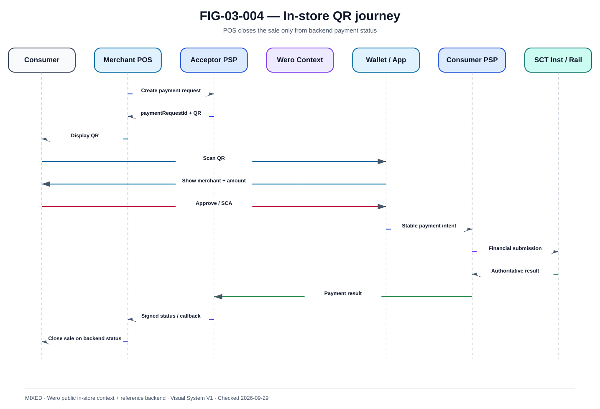

# POS, QR et paiement en magasin

La @fig-03-004 fournit la vue de référence utilisée dans ce chapitre.

{#fig-03-004}

*Statut : **MIXED** · Source(s) : Wero public in-store/QR capability + handbook reference backend · Vérifié : 2026-09-29.*

## 1. Le magasin ajoute un environnement physique

Le paiement in-store combine terminal/POS, réseau marchand, écran/QR, mobile client, application Wero/bancaire, Acceptor PSP, Consumer PSP et rail financier. Le failure domain est donc plus large qu'en e-commerce.

## 2. Dynamic QR

~~~text
POS creates order
→ Merchant backend creates payment request
→ dynamic QR generated
→ Customer scans
→ Wallet validates context
→ SCA / approval
→ payment submitted
→ merchant gets authoritative status
→ POS prints receipt / closes sale
~~~

Le QR dynamique peut contenir un token opaque vers un contexte serveur plutôt que toutes les données.

## 3. Static QR

Lorsque ce mode existe, un QR statique nécessite davantage de logique après scan :
- identify merchant ;
- obtain amount ;
- generate transaction context ;
- prevent replay ;
- ensure merchant/payment binding.

Ne pas supposer que tous les marchés Wero utilisent le même type de QR.

## 4. POS state machine

~~~text
ORDER_OPEN
→ PAYMENT_REQUESTED
→ CUSTOMER_SCANNED
→ AUTH_PENDING
→ PAYMENT_PENDING
→ PAID
~~~

Exceptions :
- EXPIRED ;
- CANCELLED_BEFORE_SUBMIT ;
- UNKNOWN ;
- REJECTED ;
- REFUND_PENDING.

## 5. Scan ≠ paiement

Le scan indique uniquement que le contexte a été lu. Il ne doit jamais déclencher la fermeture de la vente sans statut financier suffisant.

## 6. Cashier retry risk

~~~text
customer approves
→ network response lost
→ POS says timeout
→ cashier creates another payment
~~~

Contrôle :
- same order retains same logical payment context ;
- active status check ;
- display investigating ;
- supervisor flow for prolonged UNKNOWN.

## 7. Terminal offline

Une architecture account-to-account en ligne ne devient pas offline par magie.

En perte réseau marchand :
- conserver order ;
- ne pas inventer confirmation ;
- permettre reprise ;
- distinguer réseau POS et connectivité mobile client.

## 8. Receipt

Le reçu commercial peut inclure :
- merchant order ;
- amount ;
- payment method ;
- reference abrégée ;
- timestamp ;
- status.

Éviter les données personnelles/financières inutiles.

## 9. Refund at POS

Le refund initié depuis le POS passe par :
- employee authentication ;
- authorization ;
- original transaction lookup ;
- remaining refundable amount ;
- idempotent refund operation ;
- audit.

## 10. Multi-lane merchant

Pour un grand magasin :
- plusieurs caisses ;
- même backend ;
- terminal identity ;
- site/store identity ;
- local network partition.

Le merchantOrderId doit être cohérent dans le domaine marchand.

## 11. Network design

Flux :
- POS → merchant backend ;
- merchant backend → Acceptor PSP ;
- client mobile → Consumer flow.

Le POS n'a pas nécessairement une connexion directe au CSM.

## 12. Security

- terminal identity ;
- TLS ;
- protected credentials ;
- restricted outbound ;
- QR integrity ;
- anti-tamper ;
- admin separation ;
- signed software ;
- audit.

## 13. Observability

Dimensions :
- storeId ;
- terminalId ;
- merchantOrderId ;
- paymentRequestId ;
- paymentId.

KPIs :
- scan conversion ;
- timeout ;
- UNKNOWN ;
- cashier retry attempts ;
- completion ;
- refund ;
- network availability.

## 14. Peak periods

Tests :
- lunch peak ;
- sales ;
- Christmas ;
- store opening ;
- network degradation ;
- Acceptor PSP latency.

## 15. Failure scenarios

- QR expired ;
- scan twice ;
- wrong order ;
- customer approves after POS cancel ;
- callback lost ;
- merchant backend restart ;
- terminal reboot ;
- store network loss ;
- consumer network loss ;
- Acceptor outage.

Chaque cas doit préserver un état commercial explicite et une vérité financière réconciliable.
