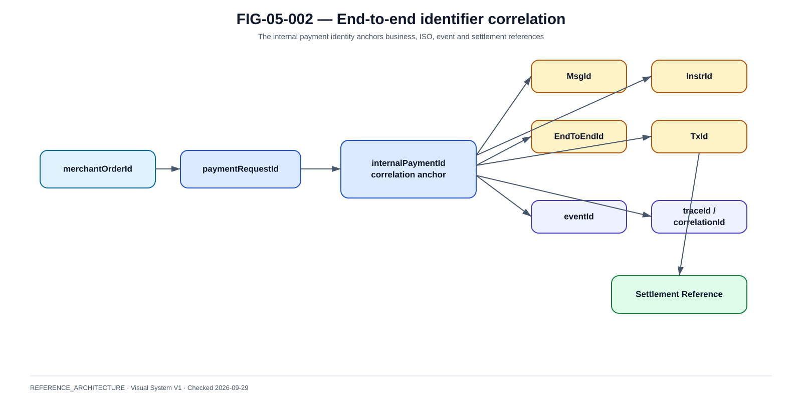

# Business Application Header et chaîne d'identifiants

La @fig-05-002 fournit la vue de référence utilisée dans ce chapitre.

{#fig-05-002}

*Statut : **REFERENCE_ARCHITECTURE** · Source(s) : Handbook reference architecture · Vérifié : 2026-09-29.*

## 1. Pourquoi l'identification est critique

Dans un incident, retrouver le XML ne suffit pas. Il faut relier l'intention client, le paiement interne, le message inter-PSP, l'événement technique et le settlement.

## 2. Business Application Header

Le BAH fournit un cadre applicatif autour du message métier.

Champs conceptuels :
- From ;
- To ;
- Business Message Identifier ;
- Message Definition Identifier ;
- Business Service ;
- Creation Date ;
- Priority lorsque prévue.

Le contenu exact dépend du profil utilisé par le scheme/infrastructure.

## 3. Message identity vs transaction identity

Ne pas confondre :
- message identifier : identifie une enveloppe/message ;
- instruction identifier : identifie une instruction dans le contexte de l'émetteur ;
- EndToEndId : corrélation de bout en bout ;
- TxId : identifiant transaction interbancaire selon modèle ;
- paymentId interne : identité dans la plateforme locale.

Un resend technique peut créer un nouveau messageId sans créer un nouveau paiement logique si le contrat le prévoit.

## 4. Correlation chain

~~~text
merchantOrderId
↔ paymentRequestId
↔ consumer/acceptor payment id
↔ internal paymentId
↔ MsgId
↔ InstrId
↔ EndToEndId
↔ TxId
↔ settlement reference
↔ eventId
↔ correlationId
↔ traceId
~~~

## 5. Uniqueness

Pour chaque identifiant définir :
- scope d'unicité ;
- générateur ;
- longueur/format ;
- durée de rétention ;
- collision handling ;
- propagation.

## 6. EndToEndId

Utilité :
- relier origine et bénéficiaire ;
- investigation ;
- reconciliation ;
- support.

Ne pas le surcharger avec des données personnelles ou une signification métier fragile.

## 7. MsgId

Le MsgId sert au message. Il peut être utilisé pour :
- duplicate detection ;
- acknowledgement ;
- investigation.

Il ne doit pas devenir la seule clé de l'objet Payment.

## 8. Original references

Messages de return/recall/investigation ont besoin de références vers l'original :
- original message ID ;
- original instruction ;
- original end-to-end ;
- original transaction.

Conserver ces liens durablement.

## 9. Mapping database

Table de référence :

| localPaymentId | MsgId | InstrId | EndToEndId | TxId | externalStatus | updatedAt |
|---|---|---|---|---|---|---|

Un paiement peut avoir plusieurs messages au cours de son cycle.

## 10. Observability identity

traceId n'est pas financial identity.

Après expiration des traces, le support doit encore retrouver le paiement par ses identifiants métier/financiers.

## 11. Privacy

Ne pas intégrer dans les IDs :
- nom ;
- téléphone ;
- e-mail ;
- IBAN complet si évitable.

Préférer des identifiants opaques.

## 12. Clock and timestamps

Store:
- business occurrence ;
- message creation ;
- local receipt ;
- processing ;
- settlement/result ;
- notification.

Utiliser une référence temporelle cohérente et gérer les time zones explicitement.

## 13. Replay

Le système doit distinguer :
- same message replay ;
- same payment new message ;
- new payment.

Cette distinction est essentielle pour la sécurité financière.

## 14. Support case

Un agent support saisit idéalement :
- paymentId ;
- orderId ;
- EndToEndId ;
- TxId.

Le système rassemble ensuite toute la chaîne au lieu d'exiger une recherche manuelle dans plusieurs logs.

## 15. Design review

- chaque identifiant a-t-il un owner ?
- où est-il créé ?
- peut-il changer ?
- est-il transmis au partenaire ?
- peut-on reconstituer l'historique après 6 mois ?
- les logs restent-ils consultables sans données sensibles excessives ?
