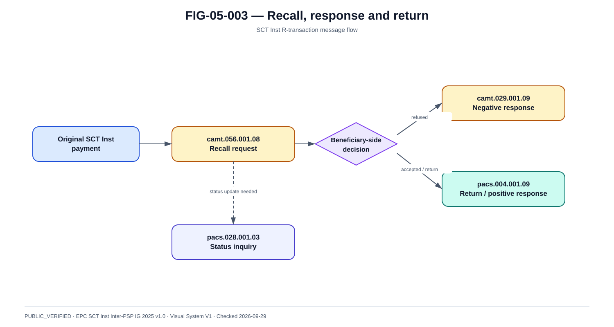

# R-transactions, recall, return et investigation ISO 20022

La @fig-05-003 fournit la vue de référence utilisée dans ce chapitre.

{#fig-05-003}

*Statut : **PUBLIC_VERIFIED** · Source(s) : EPC SCT Inst Inter-PSP IG 2025 v1.0 · Vérifié : 2026-09-29.*

## 1. Les exceptions sont le vrai test d'une architecture paiement

Le happy path est court. Les opérations d'exception durent plus longtemps, traversent des équipes et exigent des références historiques fiables.

## 2. Reject

Reject signifie que l'instruction n'a pas abouti selon le contexte du scheme.

Capture :
- reason ;
- stage ;
- agent ;
- timestamp ;
- retryability.

## 3. Return

Baseline message :
- pacs.004.001.09 dans l'IG SCT Inst 2025 pour les cas correspondants.

Le return :
- est une opération distincte ;
- référence l'original ;
- déplace les fonds en sens inverse selon le processus applicable ;
- doit être réconcilié.

## 4. Recall / cancellation request

Baseline :
- camt.056.001.08.

Semantics :
- demande, pas garantie ;
- peut être acceptée ou refusée ;
- doit porter les original references.

## 5. Negative recall response

Baseline :
- camt.029.001.09 pour la réponse négative au processus correspondant.

Le dossier doit enregistrer :
- request date ;
- response date ;
- reason ;
- operator/customer context.

## 6. Positive recall outcome

Le retour des fonds s'appuie sur le message de return prévu par le scheme.

Architecture :
~~~text
recall request
→ beneficiary side decision/process
→ return of funds
→ originator reconciliation
~~~

## 7. Status investigation

Baseline :
- pacs.028.001.03 pour les demandes de statut prévues par le profil SCT Inst 2025.

Use cases :
- missing final status ;
- recall status update ;
- transaction investigation selon règles.

## 8. UNKNOWN resolution

~~~text
payment local state UNKNOWN
→ locate original identifiers
→ send status/inquiry
→ receive authoritative information
→ compare settlement/account records
→ converge state
~~~

Le mécanisme exact dépend du participant/CSM.

## 9. camt.056 is not timeout retry

Anti-pattern :
~~~text
no pacs.002
→ camt.056 automatically
→ mark failed
~~~

Pourquoi c'est faux :
- absence de statut n'est pas nécessairement motif de recall ;
- recall est une demande métier/scheme ;
- payment peut être final ;
- l'investigation doit établir l'état.

## 10. Investigation case data

~~~text
caseId
paymentId
originalMsgId
originalEndToEndId
originalTxId
caseType
reason
externalRequests[]
externalResponses[]
operatorActions[]
status
openedAt
closedAt
~~~

## 11. Case state

~~~text
OPEN
→ CLASSIFIED
→ EXTERNAL_QUERY_SENT
→ WAITING
→ RESPONSE_RECEIVED
→ RECONCILED
→ CLOSED
~~~

Escalations :
- SLA breach ;
- high amount ;
- customer complaint ;
- fraud ;
- regulatory incident.

## 12. Reason codes

Maintain:
- scheme code ;
- version ;
- semantic category ;
- retryable? ;
- customer communication ;
- operational routing.

Reason-code catalog must be versioned with the scheme.

## 13. Accounting

A return creates accounting entries; do not erase original entries.

## 14. Operations

Queues:
- rejects needing correction ;
- unknowns ;
- recall pending ;
- return exceptions ;
- reconciliation breaks.

## 15. Auditability

An auditor/operator should reconstruct:
1. original payment ;
2. messages ;
3. reason ;
4. investigation ;
5. outcome ;
6. ledger effects ;
7. customer/merchant communication.
