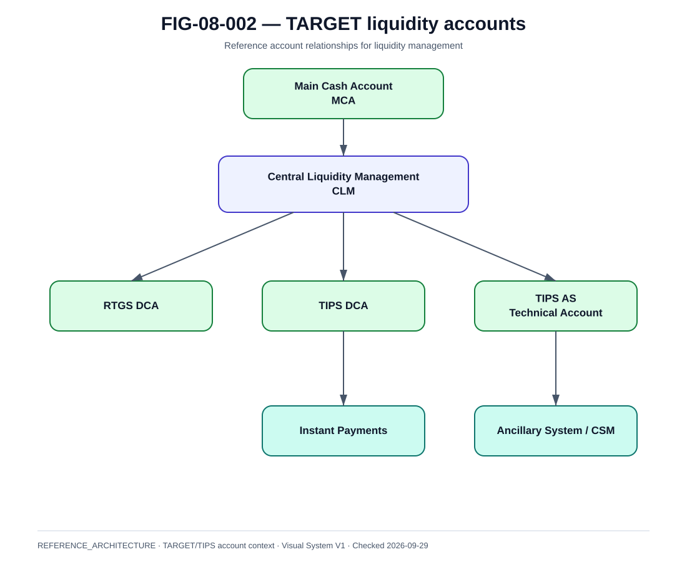

# TARGET accounts et transferts de liquidité

La @fig-08-002 synthétise le modèle utilisé dans ce chapitre.

{#fig-08-002}

*Statut : **REFERENCE_ARCHITECTURE** · Source(s) : Handbook reference view based on ECB TARGET/TIPS public model · Vérifié : 2026-09-29.*

## 1. Le settlement instantané dépend d'un compte

Dans TARGET, différents comptes répondent à des finalités distinctes.

Le livre retient notamment :
- Main Cash Account ;
- RTGS DCA ;
- TIPS DCA ;
- TIPS AS technical account ;
- autres comptes TARGET selon contexte.

## 2. Main Cash Account

Le MCA joue un rôle central dans la gestion de liquidité TARGET selon le modèle de Central Liquidity Management.

Ne pas le dessiner comme le compte de règlement direct de tous les paiements instantanés.

## 3. TIPS DCA

Utilisé pour le settlement instantané des participants TIPS selon le modèle applicable.

Propriétés à architecturer :
- balance ;
- owner ;
- currency ;
- linked liquidity accounts ;
- authorized instructing parties ;
- thresholds ;
- reporting.

## 4. TIPS AS technical account

Compte technique utilisé pour certains modèles d'Ancillary System dans TIPS.

Il est pertinent pour comprendre certains CSM, notamment RT1.

## 5. Intra-service transfer

Déplacement de liquidité entre comptes d'un même service selon les règles disponibles.

## 6. Inter-service transfer

Déplacement de liquidité entre services TARGET.

~~~text
MCA / RTGS DCA
↔ liquidity transfer
↔ TIPS DCA / TIPS AStA
~~~

Les fenêtres exactes et contraintes dépendent de l'état opérationnel des services TARGET.

## 7. TIPS continuous vs T2 hours

TIPS traite en continu 24/7/365.

La documentation opérationnelle distingue néanmoins les possibilités de transferts inter-services selon l'état des services TARGET.

Conséquence :
- prévoir un buffer hors heures de recharge disponibles ;
- monitorer les fenêtres ;
- ne pas compter sur un transfert impossible au moment critique.

## 8. Liquidity reservation

Processus de référence :
1. forecast ;
2. allocate ;
3. transfer ;
4. confirm ;
5. monitor ;
6. rebalance.

## 9. Authorization

Liquidity movement is privileged.

Controls :
- dedicated role ;
- maker/checker if policy ;
- limits ;
- strong authentication where applicable ;
- audit ;
- alert on unusual transfers.

## 10. Automation

L'automatisation peut :
- proposer un montant ;
- exécuter dans une bande approuvée ;
- stopper sur anomalie.

Elle doit avoir :
- caps ;
- emergency stop ;
- traceability ;
- human override.

## 11. Failed transfer

States :
- requested ;
- accepted ;
- completed ;
- rejected ;
- unknown.

Ne pas augmenter la liquidité disponible avant confirmation autoritative.

## 12. Reconciliation

Comparer :
- requested transfers ;
- TARGET account records ;
- local treasury records ;
- resulting payment capacity.

## 13. Day boundary

Instant-payment service ne s'aligne pas exactement sur le business-day accounting.

Gérer explicitement :
- calendar day ;
- value date ;
- T2 close ;
- reserve snapshot context ;
- reporting date.

## 14. Multi-currency

Si plusieurs devises TIPS sont supportées :
- positions séparées ;
- aucun FX implicite ;
- policy par devise ;
- settlement account explicite.

## 15. Operational dashboard

Afficher :
- account balances ;
- usable liquidity ;
- transfer state ;
- thresholds ;
- projected depletion ;
- next constrained window ;
- recent failed transfers.
