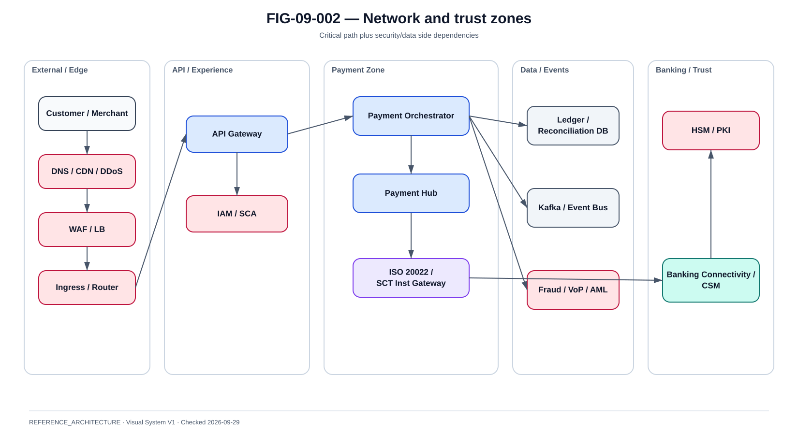

# Segmentation interne et flux East-West

La @fig-09-002 matérialise la vue de référence de ce chapitre.

{#fig-09-002}

*Statut : **REFERENCE_ARCHITECTURE** · Source(s) : Handbook reference architecture · Vérifié : 2026-09-29.*

## 1. Objectif

Limiter le blast radius sans casser la disponibilité du paiement.

## 2. Zones de référence

~~~text
Public Edge
Application Zone
Payment Zone
Data Zone
Security Services Zone
Observability Zone
Management / GitOps Zone
Banking Connectivity Zone
~~~

Une zone est une frontière de contrôle, pas seulement un subnet.

## 3. Application Zone

Expose :
- APIs ;
- orchestration ;
- stateless services.

N'accède pas directement à tout le réseau financier.

## 4. Payment Zone

Contient :
- Payment Hub adapters ;
- ISO gateways ;
- fraud/VoP connectors ;
- reconciliation services.

Access tightly controlled.

## 5. Data Zone

Contains :
- payment DB ;
- ledger ;
- event broker ;
- reconciliation store ;
- audit store.

Access only from explicit workloads.

## 6. NetworkPolicy

Kubernetes/OpenShift:
- default deny ;
- allow only required source/destination/ports ;
- namespaces explicit ;
- egress controlled.

NetworkPolicy complements, not replaces, perimeter/network controls.

## 7. Service-to-service identity

Use:
- workload identity ;
- mTLS ;
- short-lived credentials ;
- service account ;
- authorization.

IP address alone is not identity.

## 8. Egress control

Critical because payment services can otherwise reach arbitrary Internet endpoints.

Controls:
- egress proxy ;
- allowlist ;
- DNS policy ;
- TLS inspection only where legally/technically appropriate ;
- service identity.

## 9. Shared services

Examples:
- IAM ;
- PKI ;
- HSM ;
- secrets ;
- observability.

They must not create an uncontrolled flat trust zone.

## 10. East-West flow matrix

Each flow:
- source workload ;
- destination workload ;
- protocol ;
- port ;
- auth ;
- data class ;
- criticality ;
- timeout ;
- retry.

## 11. Lateral movement

Controls:
- namespace isolation ;
- least privilege ;
- no shared admin credentials ;
- runtime security ;
- image trust ;
- audit.

## 12. Internal DNS

Failure modes:
- stale service discovery ;
- wrong search domain ;
- resolver saturation ;
- cluster DNS outage.

Test dependency on cluster DNS explicitly.

## 13. Service mesh

Potential benefits:
- mTLS ;
- traffic policy ;
- telemetry.

Risks:
- added latency ;
- sidecar/control-plane dependency ;
- retry amplification ;
- operational complexity.

Use only where benefits justify.

## 14. Retry policy

Never set generic automatic retries on financial POST without idempotency semantics.

Proxy/service-mesh retry must be aligned with application retry.

## 15. Segmentation tests

- unauthorized service blocked ;
- authorized flow works ;
- egress unknown blocked ;
- one namespace compromised cannot reach DB/admin ;
- observability access remains read-only where possible.

## 16. Change management

Firewall/NetworkPolicy changes require:
- dependency map ;
- pre-prod validation ;
- rollback ;
- post-change payment tests ;
- evidence.
