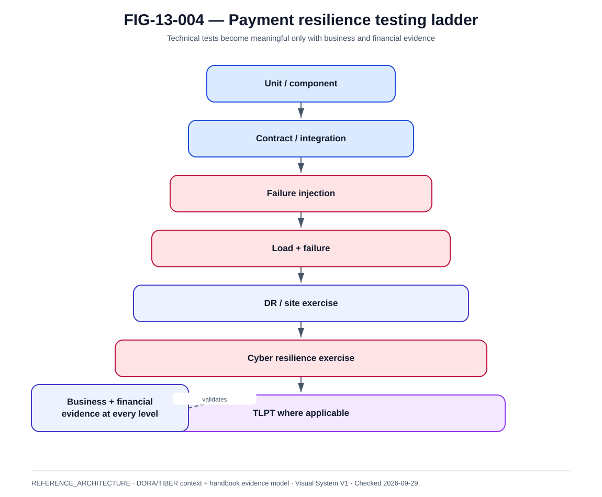

# Tests de résilience, chaos, DORA et TLPT

La @fig-13-004 complète la lecture de ce chapitre avec la vue de référence correspondante.

{#fig-13-004}

*Statut : **REFERENCE_ARCHITECTURE** · Source(s) : DORA/TIBER context + handbook evidence model · Vérifié : 2026-09-29.*

## 1. Testing pyramid

~~~text
unit
contract
integration
failure injection
load
DR exercise
cyber exercise
TLPT where applicable
~~~

Each proves different claims.

## 2. Chaos engineering

Goal:
- validate resilience hypothesis.

Not:
- randomly break production.

Hypothesis example:
> loss of one app pod causes no duplicate payment and service remains available.

## 3. Failure injection

Domains:
- process ;
- pod ;
- node ;
- DB ;
- broker ;
- DNS ;
- network ;
- cert ;
- HSM ;
- IAM ;
- site.

## 4. Business assertion

Every chaos test includes:
- technical expected ;
- financial expected ;
- customer expected.

Example:
- pod dies ;
- payment either completes once or becomes recoverable ;
- never double-settles.

## 5. Load + failure

Recovery under idle load is insufficient.

Test:
- peak traffic ;
- kill broker/node ;
- measure queue and p99.

## 6. DR exercise

Validate:
- decision ;
- fencing ;
- promotion ;
- connectivity ;
- capacity ;
- reconciliation ;
- failback.

## 7. DORA testing

DORA requires a digital operational resilience testing programme proportionate to the entity and risk, with advanced testing requirements for designated entities.

The exact legal applicability must be assessed by competent legal/compliance functions.

## 8. TLPT

Threat-Led Penetration Testing:
- intelligence-led ;
- critical functions ;
- live production context under controlled process ;
- red team ;
- blue team ;
- control team ;
- threat intelligence provider ;
- authority oversight depending framework.

## 9. TIBER-EU

The updated TIBER-EU framework is aligned with DORA TLPT RTS.

It includes DORA-aligned process steps and mandatory purple teaming in the updated framework.

## 10. Purple team

Purpose:
- share learnings ;
- replay techniques ;
- improve detection/response ;
- validate remediation.

## 11. Test evidence

For resilience test:
- hypothesis ;
- scope ;
- environment ;
- fault ;
- metrics ;
- payment IDs ;
- result ;
- limitation ;
- remediation.

## 12. Production safety

Controls:
- blast radius ;
- stop condition ;
- approvals ;
- rollback ;
- monitoring ;
- customer protection.

## 13. Supplier test

Third-party dependency scenarios:
- outage ;
- throttling ;
- bad data ;
- certificate issue ;
- recovery.

Contract should enable sufficient testing/evidence.

## 14. Test calendar

Continuous:
- app failure.

Quarterly/periodic:
- component/zone exercises.

Annual or risk-driven:
- site DR ;
- cyber scenario.

TLPT:
- according to legal/designation cycle.

## 15. Principle

A resilience claim without an executed test is a design claim, not runtime evidence.
