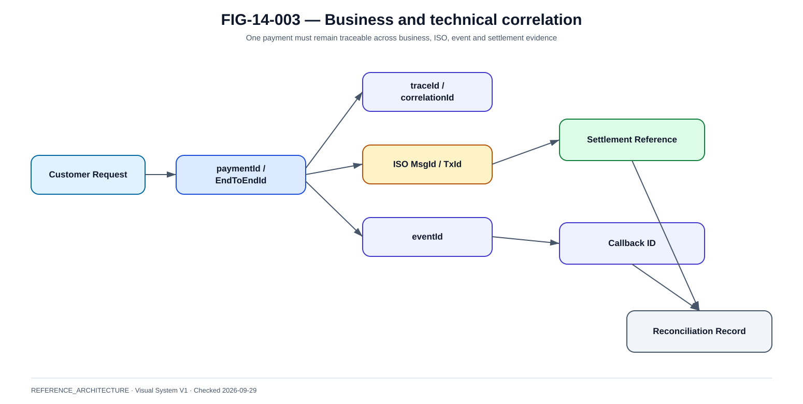

# SLI, SLO et observabilité métier

La @fig-14-003 complète la lecture de ce chapitre avec la vue de référence correspondante.

{#fig-14-003}

*Statut : **REFERENCE_ARCHITECTURE** · Source(s) : Handbook reference architecture · Vérifié : 2026-09-29.*

## 1. HTTP 200 n'est pas un SLI paiement suffisant

Un paiement peut retourner 200 puis rester UNKNOWN.

Il faut observer le service métier.

## 2. Four golden signals

- latency ;
- traffic ;
- errors ;
- saturation.

Pour paiement, ajouter :
- financial state distribution ;
- reconciliation.

## 3. Payment SLIs

Examples:
- safe initiation success ;
- time to final authoritative state ;
- UNKNOWN rate ;
- reconciliation age ;
- duplicate prevention ;
- merchant callback delivery.

## 4. Status service

Separate SLI:
- status API availability ;
- freshness ;
- authority of returned state.

Important during degraded payment execution.

## 5. SLO

SLO is internal reliability objective.

Need:
- measurement window ;
- denominator ;
- exclusions ;
- error budget ;
- owner.

No invented target in reference book.

## 6. SLA

Contractual/business commitment.

Do not copy SLO directly into SLA without legal/business decision.

## 7. Error budget

If SLO allows limited error:
- track consumption ;
- slow risky releases when exhausted ;
- prioritize reliability.

For financial correctness, some invariants have effectively zero tolerance:
- double settlement caused by platform ;
- unauthorized state override.

## 8. Business dashboard

Show:
- payments initiated ;
- settled ;
- rejected ;
- unknown ;
- refund ;
- route ;
- country ;
- merchant ;
- latency.

## 9. Technical dashboard

Show:
- pods/nodes ;
- DB ;
- broker ;
- network ;
- cert ;
- HSM ;
- CSM ;
- liquidity.

## 10. Correlation

Every trace/log/event should link where allowed:
- paymentId ;
- orderId ;
- EndToEndId ;
- TxId ;
- correlationId ;
- traceId.

## 11. Trace sampling

Payments are high-value observability.

Use:
- head/tail sampling ;
- preserve error/UNKNOWN traces ;
- data minimisation.

## 12. Log levels

Avoid DEBUG payload logging in production for sensitive payment messages.

Use structured logs with references.

## 13. Alert design

Alert on symptoms:
- finality latency ;
- unknown rate ;
- settlement rejects ;
- liquidity threshold.

Not only causes:
- CPU 80%.

## 14. Alert fatigue

Every alert needs:
- owner ;
- severity ;
- action ;
- runbook.

If no action, maybe dashboard not page.

## 15. Availability view

End-to-end availability:
~~~text
channel
AND identity
AND payment
AND core
AND rail
AND liquidity
~~~

A green cluster alone is insufficient.
