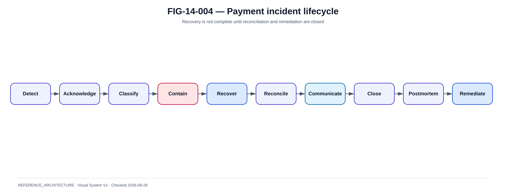

# Runbooks, incidents et post-mortems

La @fig-14-004 complète la lecture de ce chapitre avec la vue de référence correspondante.

{#fig-14-004}

*Statut : **REFERENCE_ARCHITECTURE** · Source(s) : Handbook reference architecture · Vérifié : 2026-09-29.*

## 1. Incident starts with business impact

First questions:
- can customers pay ?
- can merchants receive status ?
- are payments UNKNOWN ?
- is settlement affected ?
- is liquidity affected ?

## 2. Severity

Consider:
- customers ;
- value/volume ;
- duration ;
- regulatory criteria ;
- geographic scope ;
- security ;
- data integrity.

## 3. Roles

- incident commander ;
- technical lead ;
- payment operations ;
- communications ;
- business ;
- security ;
- treasury ;
- supplier liaison.

## 4. Timeline

~~~text
detect
→ acknowledge
→ classify
→ contain
→ recover
→ reconcile
→ communicate
→ close
→ postmortem
~~~

## 5. Runbook structure

Every runbook:
- trigger ;
- impact ;
- checks ;
- safe actions ;
- prohibited actions ;
- escalation ;
- recovery ;
- evidence.

## 6. UNKNOWN runbook

1. find payment ;
2. freeze blind retry ;
3. collect IDs ;
4. inquire external ;
5. compare ledger ;
6. reconcile ;
7. update state ;
8. notify.

## 7. Reject spike

Check:
- deployment ;
- scheme version ;
- message validation ;
- address rules ;
- participant ;
- route ;
- liquidity ;
- certificate.

## 8. Latency spike

Trace:
- edge ;
- IAM ;
- risk ;
- DB ;
- payment hub ;
- network ;
- CSM ;
- beneficiary.

## 9. Certificate incident

- identify cert ;
- issuer/trust ;
- scope ;
- rotate/revoke ;
- verify peers ;
- restore ;
- reconcile impact.

## 10. Supplier outage

- engage supplier ;
- verify alternate path ;
- apply degraded mode ;
- track SLA ;
- preserve evidence.

## 11. Communication

Do not state payment failed if UNKNOWN.

Customer communication should be accurate:
- delayed ;
- being verified ;
- completed ;
- rejected when certain.

## 12. DORA incident reporting

Current ESA operational instructions support consistent reporting of major ICT incidents but explicitly do not constitute legal interpretation.

The institution must use current legal/ITS criteria and competent authority process.

## 13. Postmortem

Include:
- impact ;
- timeline ;
- root/contributing causes ;
- detection gap ;
- resilience behavior ;
- payment correctness ;
- reconciliation ;
- actions.

## 14. No-blame vs accountability

Focus on system/process causes while preserving ownership of remediation and control decisions.

## 15. Action tracking

Each action:
- owner ;
- deadline ;
- risk ;
- verification evidence.

Close only after proof, not after code merged.
