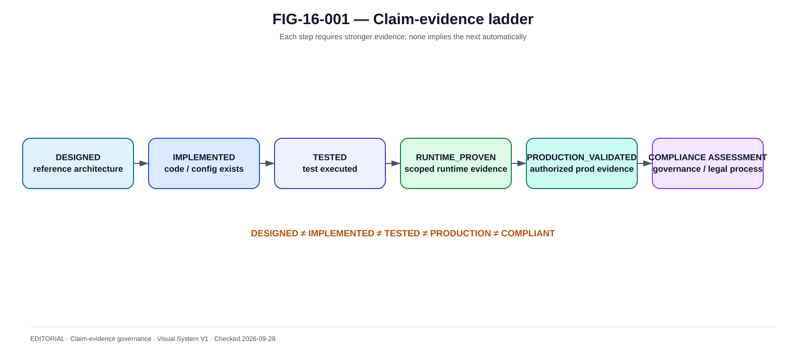

# Claim-Evidence Matrix

La @fig-16-001 complète la lecture de ce chapitre avec la vue de référence correspondante.

{#fig-16-001}

*Statut : **EDITORIAL** · Source(s) : Handbook claim-evidence governance · Vérifié : 2026-09-29.*

## 1. Why

Architecture documents often overclaim.

This handbook requires every strong statement to have evidence class.

## 2. Evidence classes

### PUBLIC_VERIFIED
Official source supports public fact.

### REFERENCE_ARCHITECTURE
Author design/recommendation.

### INFERRED
Reasoned inference from public facts.

### CI_RENDER_PROVEN
Static/build/render evidence.

### RUNTIME_PROVEN
Executed in documented environment.

### PRODUCTION_VALIDATED
Executed/observed in production under authorised evidence.

### COMPLIANT
Legal/compliance conclusion by authorised governance, not this book.

## 3. Matrix example

| Claim | Evidence required | Allowed wording |
|---|---|---|
| TIPS settles in central bank money | ECB source | public verified |
| RT1 RTGS central-bank funds | EBA CLEARING | public verified |
| Our reference network uses WAF | design | reference architecture |
| Same-key concurrency safe in lab | runtime logs/tests | runtime proven in lab |
| Multi-AZ survives zone loss | real multi-AZ test | runtime proven only after exercise |
| DORA compliant | formal compliance process | never self-declared from lab |

## 4. Environment scope

Evidence must state:
- laptop/local ;
- CRC ;
- Kind ;
- cloud sandbox ;
- preprod ;
- production.

No upward inference.

## 5. Static evidence

Examples:
- YAML renders ;
- Helm template ;
- policy exists ;
- architecture diagram.

Proves configuration intent, not runtime behavior.

## 6. Runtime evidence

Needs:
- command/test ;
- timestamp ;
- output ;
- versions ;
- environment ;
- limitation.

## 7. Failure evidence

To prove resilience:
- fault actually injected ;
- business behavior measured ;
- data correctness checked ;
- RTO/RPO measured.

## 8. Security evidence

A scanner pass proves only scanner scope.

Security claim needs layered evidence.

## 9. Compliance

DORA/PSD/IPR compliance involves:
- legal applicability ;
- governance ;
- process ;
- technical controls ;
- evidence.

Architecture supports compliance; it does not declare it.

## 10. Source freshness

Public claim includes:
- source ;
- version ;
- checked date.

## 11. Contradiction handling

If two official sources differ:
- record both ;
- identify versions/dates ;
- do not silently choose ;
- seek authoritative clarification.

## 12. Unknown

Use TO_BE_VERIFIED rather than inventing.

## 13. Review gate

Before publication:
- no high-risk TO_BE_VERIFIED ;
- every current/version claim rechecked ;
- every diagram labelled ;
- every runtime claim scoped.

## 14. Reader trust

The goal is not to make the architecture look perfect.

The goal is to make every statement traceable to what is actually known.

## 15. Motto

DESIGNED is not IMPLEMENTED.
IMPLEMENTED is not TESTED.
TESTED is not PRODUCTION.
PRODUCTION is not COMPLIANT.
