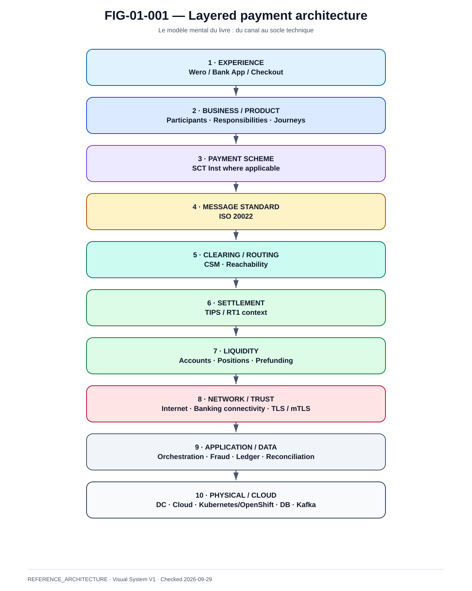

# Chapitre 1 — Lire Wero/EPI par couches

La @fig-01-001 fournit la vue de référence utilisée dans ce chapitre.

{#fig-01-001}

*Statut : **REFERENCE_ARCHITECTURE** · Source(s) : Handbook editorial model · Vérifié : 2026-09-29.*

## 1.1 Pourquoi une lecture en couches

Le terme « paiement Wero » peut désigner des réalités différentes selon l'interlocuteur.

Pour le client, il s'agit d'une expérience de paiement.  
Pour un développeur, il s'agit d'API et d'états.  
Pour une banque, il s'agit d'orchestration, de contrôles et d'un virement instantané.  
Pour un spécialiste paiements, il faut distinguer scheme, messages, clearing et settlement.  
Pour un architecte réseau, la question devient celle des chemins, zones de confiance et dépendances.  
Pour un SRE, elle devient disponibilité, saturation, timeout, duplication et réconciliation.

Le livre adopte donc une pile de lecture commune.

## 1.2 Pile de référence

```text
┌─────────────────────────────────────────────────────┐
│ 1. EXPERIENCE                                      │
│    App / wallet / checkout / POS                    │
├─────────────────────────────────────────────────────┤
│ 2. BUSINESS / PAYMENT PRODUCT                       │
│    règles, participants, responsabilités            │
├─────────────────────────────────────────────────────┤
│ 3. PAYMENT SCHEME                                   │
│    SCT Inst lorsque le parcours s'appuie sur lui    │
├─────────────────────────────────────────────────────┤
│ 4. MESSAGE STANDARD                                 │
│    ISO 20022                                        │
├─────────────────────────────────────────────────────┤
│ 5. CLEARING / ROUTING                               │
│    CSM / reachability                               │
├─────────────────────────────────────────────────────┤
│ 6. SETTLEMENT                                       │
│    mécanisme de règlement                           │
├─────────────────────────────────────────────────────┤
│ 7. LIQUIDITY                                        │
│    comptes / positions / prefunding / transferts    │
├─────────────────────────────────────────────────────┤
│ 8. NETWORK                                          │
│    Internet + réseaux bancaires + sécurité transport│
├─────────────────────────────────────────────────────┤
│ 9. APPLICATION / DATA                               │
│    orchestration, ledger, fraud, reconciliation     │
├─────────────────────────────────────────────────────┤
│10. PHYSICAL / CLOUD                                 │
│    DC, AZ, région, Kubernetes/OpenShift, DB, Kafka   │
└─────────────────────────────────────────────────────┘
```

Cette pile n'affirme pas que toutes ces couches sont opérées par une seule organisation. Au contraire, sa valeur est précisément de rendre visibles les frontières de responsabilité.

## 1.3 Cinq confusions à éviter

### Wero n'est pas ISO 20022

Wero est une expérience et un écosystème de paiement ; ISO 20022 est un standard de messages utilisé dans les infrastructures financières correspondantes.

### ISO 20022 n'est pas un rail

Un message `pacs.008` décrit une instruction financière ; il n'est pas à lui seul le système de clearing ou de settlement.

### SCT Inst n'est pas TIPS

SCT Inst définit un scheme. TIPS est une infrastructure de règlement. Les responsabilités, règles et dépendances ne sont donc pas interchangeables.

### CSM n'est pas synonyme de banque centrale

Une infrastructure de clearing/routing et le mécanisme final de settlement doivent être décrits séparément.

### Succès HTTP n'est pas finalité financière

Un `200 OK` ou un redirect de navigateur ne constitue jamais à lui seul une preuve que le paiement interbancaire est définitivement réglé.

## 1.4 Vue architecte

L'architecte doit être capable de répondre à toutes les questions suivantes pour une transaction :

- quel acteur initie ?
- qui authentifie ?
- qui porte le consentement ?
- où est décidé le statut commercial ?
- où est l'état financier ?
- quel identifiant permet la corrélation ?
- quel message transporte l'instruction ?
- quel rail est utilisé ?
- où intervient le règlement ?
- comment la liquidité est-elle vérifiée ?
- quels réseaux sont traversés ?
- quelles zones de confiance sont franchies ?
- que se passe-t-il si la réponse est perdue ?
- qui réconcilie ?
- comment empêcher un deuxième paiement ?
- quelles preuves permettent d'affirmer le résultat final ?

Ces questions structurent tout le reste du livre.

## 1.5 Vérité publique vs architecture proposée

Deux vues cohabiteront :

**PUBLIC_VERIFIED**  
Ce qui est confirmé par les sources officielles.

**REFERENCE_ARCHITECTURE**  
Une architecture professionnelle proposée pour expliquer comment une banque, un PSP ou une plateforme pourrait mettre en œuvre les exigences et parcours.

Cette séparation est indispensable : un bon ouvrage d'architecture doit expliquer ce qui est connu sans inventer ce qui n'est pas public.
