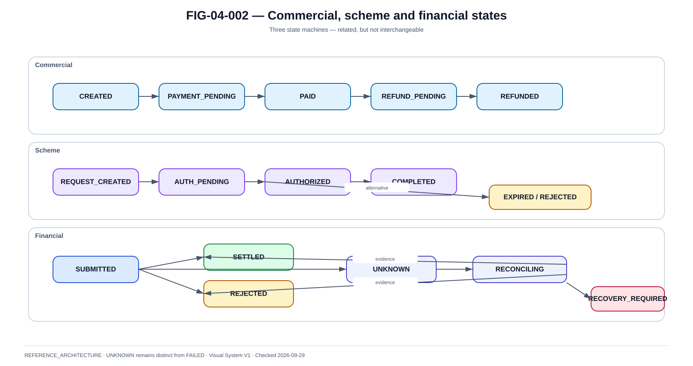

# Machines d'état et invariants

La @fig-04-002 fournit la vue de référence utilisée dans ce chapitre.

{#fig-04-002}

*Statut : **REFERENCE_ARCHITECTURE** · Source(s) : Handbook reference architecture · Vérifié : 2026-09-29.*

## Un statut unique est insuffisant

Le livre maintient au moins quatre axes : commercial, consent/customer, orchestration/scheme et financial.

## Commercial state

~~~text
ORDER_CREATED
→ PAYMENT_PENDING
→ PAID
→ FULFILLED
→ REFUND_PENDING
→ PARTIALLY_REFUNDED
→ REFUNDED
~~~

Un order CANCELLED n'implique pas que le paiement soit annulé s'il a déjà été exécuté.

## Consent state

~~~text
NOT_STARTED
→ AUTHENTICATING
→ PRESENTED
→ APPROVED
~~~

Branches :

- DECLINED ;
- EXPIRED ;
- CANCELLED.

Approval ne prouve pas le settlement.

## Financial state

~~~text
CREATED
→ READY_TO_SUBMIT
→ SUBMITTED
→ SETTLED
~~~

Branches :

- REJECTED ;
- UNKNOWN → RECONCILING → SETTLED / REJECTED / MANUAL_REVIEW.

## UNKNOWN comme first-class state

Properties :

- financial effect may exist ;
- no blind retry ;
- controlled communication ;
- reconciliation deadline ;
- operator visibility.

UNKNOWN n'est pas une exception technique générique.

## Terminal states

Définir explicitement :

- SETTLED ;
- REJECTED ;
- CANCELLED_BEFORE_SUBMIT ;
- RETURNED ;
- REFUNDED selon l'entité.

Une API générique ne doit pas rouvrir librement un terminal state.

## Transition guards

CREATED → READY_TO_SUBMIT :

- valid amount ;
- eligible participant ;
- consent ;
- risk controls.

READY_TO_SUBMIT → SUBMITTED :

- one financial submission token ;
- durable intent ;
- idempotency claim.

SUBMITTED → SETTLED :

- authoritative positive outcome.

SUBMITTED → REJECTED :

- authoritative negative outcome.

SUBMITTED → UNKNOWN :

- outcome cannot be determined safely.

## Optimistic concurrency

~~~text
UPDATE payment
SET state=?, version=version+1
WHERE payment_id=? AND version=?
~~~

Si aucune ligne :

- reread ;
- resolve competing transition ;
- never overwrite blindly.

## Monotonicity

~~~text
local heuristic < callback < authoritative inquiry/rail result
~~~

Un vieux PENDING ne doit pas écraser SETTLED.

## Duplicate event

1. claim eventId ;
2. read state/version ;
3. if already applied, acknowledge ;
4. else apply atomically.

## Out-of-order event

SETTLED puis ancien PENDING :

- conserver SETTLED ;
- enregistrer éventuellement l'anomalie ;
- ne pas réouvrir.

## Side effects

Transition peut déclencher :

- notification ;
- fulfilment ;
- audit ;
- event.

Outbox lie état durable et intention d'événement.

## Recovery transition

UNKNOWN → RECONCILING doit stocker :

- inquiry attempts ;
- external reference ;
- result ;
- operator action ;
- timestamps.

## State reason

~~~text
state = REJECTED
schemeReason = AC01
internalCategory = INVALID_ACCOUNT
customerMessageKey = PAYEE_ACCOUNT_INVALID
~~~

Le message client ne doit pas exposer des diagnostics internes.

## Testing

Chaque transition :

- positive test ;
- invalid previous-state test ;
- concurrent transition test ;
- duplicate test ;
- recovery test.

## Audit

Append :

- before ;
- after ;
- actor ;
- cause ;
- source ;
- correlation ;
- time.
