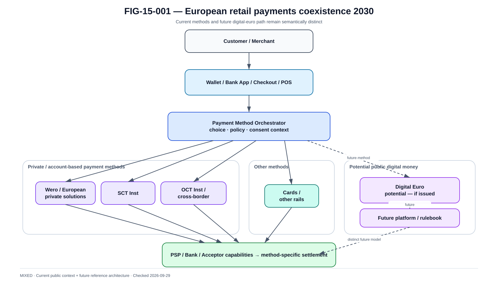

# Architecture européenne des paiements 2030 — vue de référence

La @fig-15-001 complète la lecture de ce chapitre avec la vue de référence correspondante.

{#fig-15-001}

*Statut : **MIXED** · Source(s) : ECB digital euro preparation + EPI/Wero public roadmap context + EPC schemes + handbook reference architecture · Vérifié : 2026-09-29.*

## Objective

Build an architecture able to absorb new methods without rebuilding bank core for each wallet.

## Layered direction

~~~text
Experience
→ Identity / Consent
→ Payment Method Orchestration
→ Risk / VoP
→ Payment Hub
→ Scheme / Rail adapters
→ Settlement / Liquidity
→ Reconciliation
~~~

## Payment methods

Potential portfolio:

- Wero ;
- SCT Inst ;
- OCT Inst ;
- cards ;
- digital euro if issued ;
- other local/international methods.

## Common capabilities

Share where safe:

- customer IAM ;
- merchant onboarding ;
- fraud platform ;
- API management ;
- observability ;
- reconciliation framework ;
- secrets/PKI.

## Keep separate

Do not over-share:

- financial state machine if semantics differ ;
- settlement adapter ;
- dispute model ;
- asset/ledger ;
- legal retention.

## Merchant abstraction

A merchant can receive:

- payment intent API ;
- method selection ;
- status ;
- refund ;
- reporting.

Backend chooses method-specific execution.

## European identity

eIDAS2/EUDI developments may affect:

- onboarding ;
- authentication ;
- attribute sharing.

Do not assume exact Wero integration without public evidence.

## Real-time everywhere

Trends:

- instant settlement ;
- 24/7 operations ;
- real-time fraud ;
- real-time treasury ;
- real-time reconciliation.

Architecture must remove end-of-day assumptions.

## Data

Use event-driven reporting while keeping authoritative ledger.

Future AI use:

- fraud ;
- capacity ;
- liquidity forecasting ;
- operations assistance.

Never let AI invent settlement state.

## AI agents

ECB innovation work in 2026 explores AI/payment scenarios.

Architecture guardrail:

- agent can propose/initiate within authorization ;
- deterministic policy validates ;
- human/customer consent where required ;
- payment engine remains authoritative.

## Programmability

Possible future services:

- subscriptions ;
- conditional merchant flows ;
- micropayments ;
- smart routing.

Keep financial core controlled.

## Resilience

2030 architecture should isolate:

- channel ;
- method ;
- rail ;
- region ;
- provider.

One rail outage should not corrupt others.

## Sovereignty

European payments strategy increasingly values:

- European reach ;
- resilience ;
- reduced concentration ;
- open standards.

Architecture should measure dependencies rather than use sovereignty as marketing label.

## Migration strategy

Evolve by adapters/capabilities:

- add method ;
- certify ;
- migrate traffic ;
- retire legacy.

Avoid big-bang core replacement.

## Five-year principle

Stable core concepts:

- truth ;
- idempotency ;
- finality ;
- reconciliation ;
- trust ;
- failure domains.

Volatile:

- products ;
- participants ;
- rules ;
- versions ;
- regulation.

The book versions the volatile layer and keeps the stable principles reusable.
