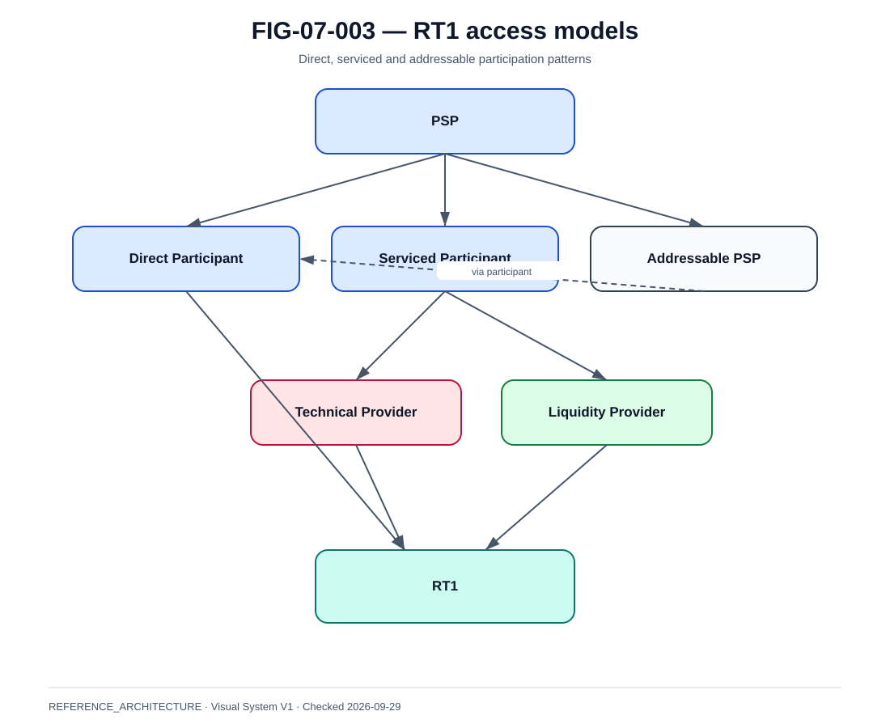

# RT1 — service, participation et settlement

La @fig-07-003 synthétise le modèle utilisé dans ce chapitre.

{#fig-07-003}

*Statut : **REFERENCE_ARCHITECTURE** · Source(s) : Handbook reference view based on EBA CLEARING RT1 public model · Vérifié : 2026-09-29.*

## Rôle

RT1 est un système pan-européen d'EBA CLEARING pour les paiements instantanés, notamment SCT Inst, opérant 24/7.

Les sources publiques le décrivent comme :

- real-time gross settlement ;
- en fonds banque centrale immédiatement disponibles ;
- avec finalité et sans risque de crédit lié au settlement entre participants ;
- interopérable avec d'autres CSM SCT Inst ;
- doté d'outils de liquidité 24/7.

## Modèle de fonds

Le PFMI disclosure RT1 décrit une funds balance par participant, alimentée en monnaie banque centrale via le modèle de compte technique applicable.

Invariant :

- une position ne peut pas devenir négative ;
- une transaction qui dépasserait la liquidité disponible est rejetée selon le fonctionnement du système.

## RT1 et TIPS

RT1 est distinct de TIPS mais utilise l'infrastructure TIPS dans son modèle de compte technique et propose des capacités d'interaction avec TIPS.

~~~text
RT1 payment system
→ participant positions / processing
→ TIPS technical-account settlement context
~~~

## Access models

Les sources EBA CLEARING décrivent plusieurs modes :

- participant connecté directement ;
- serviced participant ;
- addressable PSP ;
- technical service provider ;
- liquidity provider.

~~~text
PSP
├─ direct connection
├─ technical provider
└─ serviced model
      ├─ connectivity provider
      └─ liquidity provider
~~~

## Serviced participant

Conséquences :

- responsabilité métier reste au PSP selon contrat/règles ;
- dépendance à un fournisseur ;
- RTO/RPO fournisseur ;
- concentration risk ;
- DORA third-party mapping ;
- exit plan.

## Addressable PSP

Un PSP peut être reachable via un participant.

Le routing doit donc distinguer :

- participant direct ;
- addressable/reachable PSP ;
- intermediary relationship.

## Reachability

RT1 annonce une reachability pan-européenne via plusieurs mécanismes.

Le moteur de route doit maintenir :

- destination ;
- preferred CSM ;
- addressability ;
- route health ;
- fallback rules.

## Liquidity provider

Si un participant dépend d'un liquidity provider :

- contractual SLA ;
- limits ;
- operating model ;
- monitoring ;
- emergency contact ;
- fallback ;
- concentration.

## Single interface capabilities

EBA CLEARING décrit des options permettant aux participants d'utiliser l'interface RT1 pour des transactions se réglant dans RT1 et TIPS.

Conséquence :

- ne pas déduire que le backend financier est identique ;
- conserver destination et settlement context explicites.

## Routing data

~~~text
participantDirectory
- pspId
- directRt1
- addressableRt1
- tipsReachable
- technicalProvider
- liquidityProvider
- routePriority
- effectiveFrom
- effectiveTo
~~~

## Operational availability

24/7 implique :

- active monitoring ;
- certificate management ;
- support on-call ;
- liquidity supervision ;
- participant directory updates ;
- change windows controlled.

## Testing

L'intégration requiert :

- connectivity tests ;
- message validation ;
- negative paths ;
- failover tests ;
- regression pack.

## Incident

Examples :

- RT1 connection down ;
- technical provider down ;
- liquidity provider unavailable ;
- participant addressability wrong ;
- reject spike ;
- position low ;
- TIPS-related technical dependency issue.

## Reconciliation

Store :

- RT1 reference ;
- SCT Inst identifiers ;
- participant ;
- settlement evidence ;
- local ledger ;
- merchant/customer status.

## Rule

RT1 ne doit jamais être résumé à un autre réseau. C'est un système de paiement avec modèle de participation, reachability, liquidité, exploitation et settlement.
