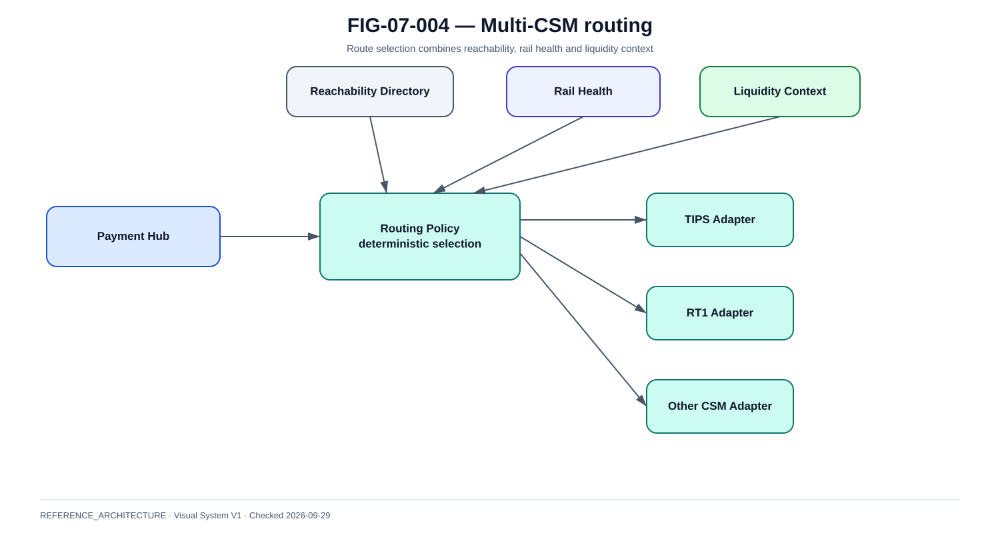

# Reachability, routing et architecture multi-CSM

La @fig-07-004 synthétise le modèle utilisé dans ce chapitre.

{#fig-07-004}

*Statut : **REFERENCE_ARCHITECTURE** · Source(s) : Handbook reference architecture · Vérifié : 2026-09-29.*

## La reachability précède le routing

Avant de choisir une route, le système doit savoir si le beneficiary PSP est atteignable et par quel mécanisme.

## Reachability model

Data :

- participantId ;
- BIC/identifier selon scheme ;
- direct/indirect ;
- CSMs ;
- effective dates ;
- capabilities ;
- status ;
- source ;
- lastUpdated.

## Directory freshness

Une table de route obsolète peut envoyer vers un mauvais CSM, générer des rejects ou allonger le temps.

Controls :

- verified source ;
- scheduled refresh ;
- diff review ;
- effective-date support ;
- rollback.

## Route policy

Inputs :

- reachability ;
- participant preference ;
- operational health ;
- liquidity ;
- cost ;
- latency ;
- contractual rules ;
- regulation.

Output :

- selected route ;
- reason ;
- policy version.

## Determinism

~~~text
payment X
→ routing policy v17
→ destination PSP Y
→ route RT1
→ reason = preferred + reachable + healthy
~~~

Le routing ne doit pas être opaque.

## Multi-CSM architecture

~~~text
Payment Hub
    |
Routing Service
    |
    +-- TIPS Adapter
    +-- RT1 Adapter
    +-- Other CSM Adapter
~~~

Chaque adapter porte le même canonical intent avec son contrat, sa connexion, son health et sa reconciliation.

## Fallback before submit

Si route A est indisponible et aucune instruction n'a été soumise :

- route B possible si destination reachable et policy permet ;
- garder same logical payment ;
- lier la nouvelle tentative de route.

## Fallback after uncertain submit

Interdit par défaut :

~~~text
submit A
→ timeout
→ submit B
~~~

Correct :

~~~text
A becomes UNKNOWN
→ resolve A
→ only if authoritative no-effect
   then route B
~~~

## Rail health

Levels :

- GREEN ;
- DEGRADED ;
- UNAVAILABLE ;
- UNKNOWN.

Inputs :

- connectivity ;
- rejects ;
- latency ;
- operator notice ;
- liquidity ;
- probes where allowed.

## Routing flapping

Controls :

- hysteresis ;
- minimum hold time ;
- manual override ;
- audit.

## Liquidity-aware routing

Risks :

- oscillation ;
- depletion of alternate rail ;
- cost surprises ;
- non-deterministic behavior.

Controls :

- threshold bands ;
- treasury approval ;
- caps ;
- stable policy.

## Cost-aware routing

Le coût ne doit jamais dégrader :

- scheme compliance ;
- settlement certainty ;
- resilience ;
- customer timing.

## Testing

- direct route ;
- indirect route ;
- destination only on one CSM ;
- preferred route down before submit ;
- route timeout after submit ;
- directory stale ;
- conflicting reachability ;
- liquidity low ;
- route flapping.

## Observability

KPIs :

- route distribution ;
- route changes ;
- fallback count ;
- routing decision latency ;
- reachability misses ;
- directory freshness ;
- route-specific UNKNOWN.

## Governance

Une modification de routing policy est un changement production :

- review ;
- test ;
- versioning ;
- rollback ;
- audit.
