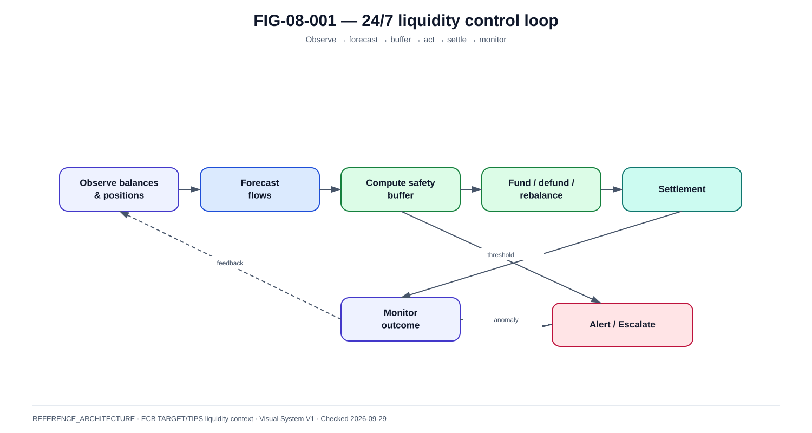

# Partie VII — Settlement et liquidité 24/7/365

La @fig-08-001 synthétise le modèle utilisé dans ce chapitre.

{#fig-08-001}

*Statut : **REFERENCE_ARCHITECTURE** · Source(s) : ECB TARGET/TIPS public liquidity model + handbook control loop · Vérifié : 2026-09-29.*

## Pourquoi la liquidité est une architecture

Une plateforme instant payment peut être parfaitement disponible et pourtant incapable de régler une transaction si la liquidité nécessaire n'est pas disponible au bon endroit.

La disponibilité réelle est donc :

```text
application availability
AND network availability
AND rail availability
AND participant reachability
AND sufficient settlement liquidity
```

## Central bank money

TIPS règle en monnaie banque centrale.

Architecturalement, cela élimine le besoin d'interpréter un paiement final comme une simple créance bilatérale non réglée. Mais cela introduit une exigence opérationnelle forte :

- position suffisante ;
- transfert de liquidité ;
- monitoring ;
- alerting.

## MCA, DCA et CLM

La BCE décrit un Main Cash Account dans le cadre de Central Liquidity Management et des Dedicated Cash Accounts pour les services TARGET.

Vue pédagogique :

```text
                  Main Cash Account
                         |
              Central Liquidity Management
                 /        |        \
                /         |         \
            T2 RTGS      T2S       TIPS DCA
```

Cette vue explique la gestion centralisée ; les règles opérationnelles réelles doivent être prises dans la documentation TARGET applicable.

## TIPS DCA

Un participant direct peut utiliser un TIPS DCA pour le settlement instantané.

Questions d'architecture :

- qui surveille le solde ?
- seuil minimum ?
- buffer de pointe ?
- comment refunder ?
- qui autorise un transfert de liquidité ?
- que se passe-t-il lorsque T2 est fermé mais TIPS continue 24/7 ?
- quelle liquidité doit rester disponible pour week-end/jours fériés ?

## AS technical accounts / prefunding

Les infrastructures ancillary peuvent utiliser des comptes techniques alimentés par les participants.

Le rapport TARGET 2025 décrit le prefunding comme une manière de mettre de côté des fonds pour soutenir des positions et le settlement en dehors des heures RTGS classiques.

Trade-off :

```text
more prefunding
= resilience / certainty
but
= liquidity fragmentation / opportunity cost
```

## RT1 liquidity

RT1 annonce un real-time gross settlement en central bank funds et fournit des outils de liquidity management 24/7.

Le design bancaire doit donc intégrer le rail dans le liquidity dashboard, même si le compte ou mécanisme exact diffère de la route TIPS directe.

## Liquidity control loop

```text
observe balances
    |
forecast outflows
    |
calculate safety buffer
    |
transfer / rebalance
    |
monitor settlement
    |
alert / escalate
```

## Forecast

Inputs possibles :

- historique heure/jour ;
- paie/salaires ;
- fin de mois ;
- Black Friday ;
- soldes ;
- événements sportifs ;
- campagnes marchands ;
- jours fériés ;
- incident sur un autre rail ;
- retry storm.

L'IA peut assister la prévision mais la décision de transfert de fonds doit rester gouvernée et contrôlée.

## Threshold model

Référence :

```text
GREEN  balance > forecast + safety
AMBER  balance approaching safety
RED    balance threatens payment continuity
```

Actions :

- alert ;
- rebalance ;
- route policy adjustment si autorisé ;
- management escalation ;
- controlled degraded mode.

## Week-end problem

Instant payments ne ferment pas le vendredi soir.

La banque doit prévoir :

- flux entrants/sortants ;
- impossibilité éventuelle de certains transferts traditionnels pendant des fenêtres ;
- jours fériés ;
- variation d'activité commerciale ;
- buffer d'urgence.

## Liquidity vs application retry

Insufficient liquidity n'est pas nécessairement une panne logicielle.

Le retry applicatif rapide peut :

- amplifier la pression ;
- créer une retry storm ;
- masquer un problème financier.

Le reason doit être classifié comme tel et alimenter les équipes Treasury/Liquidity.

## Multi-rail liquidity

Si plusieurs rails sont disponibles :

```text
Global liquidity view
  |
  +--> TIPS direct buffer
  +--> RT1-related buffer/position
  +--> other CSM positions
```

Le routing peut techniquement dépendre de la liquidité, mais cela exige une gouvernance stricte pour éviter des oscillations ou décisions non explicables.

## Observability

Dashboard minimum :

- balance current ;
- available liquidity ;
- inflow/outflow rate ;
- projected 15/30/60 min ;
- number/value queued/rejected ;
- liquidity transfers ;
- route positions ;
- threshold breaches ;
- time since last successful rebalance.

## Stress scenarios

### L1 — traffic x5
Mesurer consommation du buffer.

### L2 — outflow asymmetry
Beaucoup plus de paiements sortants qu'entrants.

### L3 — rail failover
Une route tombe et concentre les paiements sur l'autre.

### L4 — liquidity transfer unavailable
TIPS continue mais le mécanisme de recharge attendu n'est pas utilisable.

### L5 — wrong forecast
Erreur de modèle ou données tardives.

### L6 — operational mistake
Transfert excessif ou vers mauvaise position.

## Controls

- maker/checker selon criticité ;
- limits ;
- alert thresholds ;
- audit ;
- reconciliation ;
- emergency playbook ;
- independent risk controls ;
- rollback/recovery process.

## RTO/RPO appliqué à la liquidité

RPO n'a pas exactement le même sens que pour une base applicative.

Les objectifs pertinents incluent :

- fraîcheur du solde ;
- fraîcheur de la projection ;
- délai de détection ;
- délai de recharge ;
- délai de décision ;
- capacité à prouver les mouvements.

## Conclusion

La liquidité est un service critique. Un livre qui explique SCT Inst sans expliquer où se trouve l'actif de règlement, comment les comptes sont financés et comment la banque fonctionne le dimanche à 03:00 reste incomplet.
