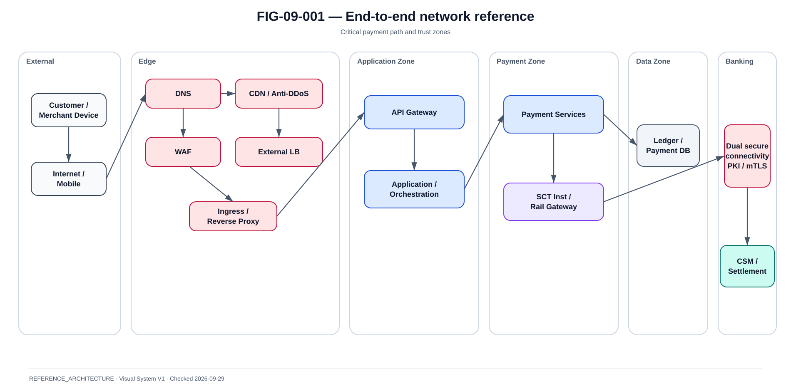

# Partie VIII — Réseaux et flux de bout en bout

La @fig-09-001 matérialise la vue de référence de ce chapitre.

{#fig-09-001}

*Statut : **REFERENCE_ARCHITECTURE** · Source(s) : Handbook reference architecture · Vérifié : 2026-09-29.*

## Le réseau fait partie du paiement

Une architecture de paiement ne peut pas reléguer le réseau à une annexe. Une transaction peut échouer alors que les microservices sont parfaitement sains :

- DNS non résolu ;
- certificat expiré ;
- route réseau indisponible ;
- firewall bloquant ;
- mTLS cassé ;
- load balancer saturé ;
- proxy hors service ;
- latence excessive ;
- réponse perdue après effet financier ;
- interconnexion CSM indisponible.

Le réseau doit donc être modélisé avec le même niveau de précision que les composants applicatifs.

## Vue de référence

~~~text
Customer device
      |
Internet / Mobile network
      |
DNS
      |
Anti-DDoS / CDN where applicable
      |
WAF
      |
External Load Balancer
      |
Reverse Proxy / Ingress
      |
API Gateway
      |
Application zone
      |
Payment zone
      |
Core / Ledger zone
      |
SCT Inst Gateway
      |
Banking connectivity / secure network
      |
CSM / settlement infrastructure
~~~

Cette vue est une REFERENCE_ARCHITECTURE, pas une topologie Wero/EPI publiée.

## Zones

| Zone | Fonction | Entrées autorisées |
|---|---|---|
| Public Edge | terminaison/exposition contrôlée | Internet |
| API Zone | authn/authz/rate limit | Edge |
| App Zone | services métier | API/interne |
| Payment Zone | orchestration financière | App |
| Data Zone | DB/ledger/event | services autorisés |
| Security Zone | IAM/PKI/HSM/Vault | flux dédiés |
| Banking Connectivity | passerelles scheme/CSM | Payment Zone |
| Operations | monitoring/admin | bastion/control plane |

Principe : deny by default, puis ouverture des flux nécessaires.

## DNS

Le DNS est critique parce qu'il précède souvent les API, identity providers, PSP externes, endpoints de rail et outils d'observabilité.

Contrôles :

- plusieurs resolvers ;
- health checks ;
- TTL maîtrisé ;
- DNSSEC lorsque pertinent ;
- split-horizon gouverné ;
- monitoring des records et expirations ;
- runbook de cache et de bascule.

Failure test :

~~~text
DNS unavailable
→ no speculative endpoint fallback
→ alert
→ controlled recovery
~~~

## Anti-DDoS / WAF

Le WAF protège l'exposition HTTP, pas le rail interbancaire.

Capabilities :

- bot filtering ;
- rate limit ;
- IP reputation ;
- payload validation ;
- virtual patching ;
- L7 DDoS.

Un WAF trop agressif peut devenir la cause de l'outage. Une réponse WAF 403 doit rester distincte d'un rejet métier ou scheme.

## Load balancer, reverse proxy et ingress

Questions :

- L4 ou L7 ?
- TLS pass-through ou termination ?
- re-encrypt ?
- session affinity réellement nécessaire ?
- readiness semantics ?
- retry automatique du proxy ?

### Danger du retry automatique

Un reverse proxy ne doit pas rejouer aveuglément un POST financier après timeout si le backend a pu exécuter l'opération.

Politique :

- retry safe GET/health selon règles ;
- POST payment uniquement avec contrat idempotent explicitement conçu ;
- timeout propagé avec correlation id ;
- retry budget borné.

## API Gateway

Fonctions :

- authentification et autorisation ;
- token validation ;
- quotas ;
- rate limiting ;
- schema checks ;
- routing ;
- observability ;
- request-size control ;
- threat protection.

Le gateway ne doit jamais devenir la source de vérité d'un paiement.

## Firewalls et matrice des flux

La matrice doit documenter :

- source ;
- destination ;
- protocol ;
- port ;
- direction ;
- TLS ;
- identité ;
- purpose ;
- owner ;
- environment ;
- timeout ;
- retry policy.

Exemple :

| ID | Source | Destination | Protocol | Port | Security | Purpose |
|---|---|---|---|---:|---|---|
| F01 | Mobile | Public API | HTTPS | 443 | TLS | customer API |
| F02 | API GW | Orchestrator | HTTPS | target-defined | mTLS/OAuth | payment |
| F03 | Orchestrator | Fraud | HTTPS | target-defined | mTLS | scoring |
| F04 | Orchestrator | Event Broker | broker protocol | target-defined | TLS/auth | events |
| F05 | Rail Gateway | CSM endpoint | scheme-specific | contract | PKI/mTLS | SCT Inst |
| F06 | Service | HSM | vendor protocol | contract | mutual auth | cryptography |

Les ports non publics sont illustratifs tant qu'ils ne sont pas appuyés par le contrat cible.

## North-south et east-west

North-south : client/partenaire externe vers la plateforme.

East-west : service vers service au sein de la plateforme.

Une architecture Zero Trust sécurise les deux. Être dans le même cluster Kubernetes ne constitue pas une authentification.

## Banking connectivity

Le chemin inter-PSP/CSM peut utiliser des connectivités dédiées ou des endpoints approuvés.

Le livre impose :

- documenter la capability de connectivité ;
- ne pas inventer le fournisseur ;
- cartographier liens primaire/secondaire ;
- inclure PKI/certificats ;
- identifier l'ownership.

## Dual connectivity

~~~text
Gateway A ---- Link/Provider A ---- CSM
Gateway B ---- Link/Provider B ---- CSM
~~~

La diversité physique doit être vérifiée :

- routers séparés ?
- opérateurs séparés ?
- fibres/ducts séparés ?
- alimentation séparée ?
- DNS séparé ?
- chaînes de certificats distinctes ?

Deux VLAN sur un même routeur ne constituent pas une résilience physique indépendante.

## TLS / mTLS / PKI

Points obligatoires :

- TLS policy ;
- certificats ;
- trust stores ;
- mutual authentication lorsque requise ;
- rotation ;
- alertes d'expiration ;
- revocation ;
- cipher policy ;
- clock synchronization.

Un certificat expiré est un scénario de panne paiement.

PKI doit identifier :

- root/intermediate CA ;
- enrollment ;
- renouvellement ;
- ownership ;
- protection des clés ;
- emergency rotation ;
- distribution de confiance.

## HSM connectivity

Le HSM est à la fois dépendance sécurité et disponibilité.

Questions :

- cluster/HA ?
- network path ?
- session limits ?
- partition/tenant ?
- backup ?
- latency ?
- DR ?
- operator quorum ?

Un HSM peut arrêter signature ou chiffrement même lorsque tous les pods sont verts.

## Latency budget

Le budget end-to-end couvre :

~~~text
device
+ internet
+ edge
+ API
+ auth
+ risk
+ core
+ rail gateway
+ network to CSM
+ remote PSP
+ return path
~~~

Mesurer p50, p95, p99 et p99.9, surtout pendant les incidents.

## TCP et connexions

Sujets :

- connection pools ;
- keepalive ;
- DNS refresh ;
- NAT exhaustion ;
- ephemeral ports ;
- SYN backlog ;
- idle timeout ;
- retransmission ;
- proxy timeout.

Une plateforme peut tomber en connection exhaustion longtemps avant 100 % CPU.

## MTU et fragmentation

Pertinent avec VPN, overlays, service mesh et tunnels chiffrés.

Symptômes :

- échecs intermittents de gros messages ;
- TLS handshake instable ;
- retransmissions.

Le runbook réseau doit inclure path-MTU si l'environnement l'exige.

## Kubernetes/OpenShift network

Couches :

- node network ;
- pod network ;
- Service ;
- ingress/router ;
- NetworkPolicy ;
- egress ;
- DNS ;
- load balancer ;
- service mesh éventuel.

NetworkPolicy ne remplace pas firewall, workload identity, TLS ou egress governance.

## Failure catalogue réseau

N1 DNS loss : alerte, aucun double paiement.

N2 WAF failure : edge redondant ou outage contrôlé.

N3 API gateway overload : backpressure, pas de retry storm.

N4 CSM link A loss : second path uniquement si le contrat/topologie le permet.

N5 response packet loss after settlement : UNKNOWN + inquiry.

N6 certificate expiry : détecté avant expiration ; emergency rotation.

N7 HSM partition : fail controlled ; pas de fallback non sécurisé.

N8 broker network partition : paiement durable via Outbox.

N9 DB network partition : quorum/fencing ; jamais deux writers divergents.

## Flow matrix contract

Champs recommandés :

~~~text
flow_id
source
destination
environment
protocol
port
tls_mode
authn
authz
data_classification
business_purpose
timeout
retry_policy
owner
monitoring
~~~

## Conclusion

Le réseau n'est pas de la plomberie. Il participe à la machine d'état financière parce qu'un message perdu, retardé ou dupliqué change ce que le système sait du résultat du paiement.
