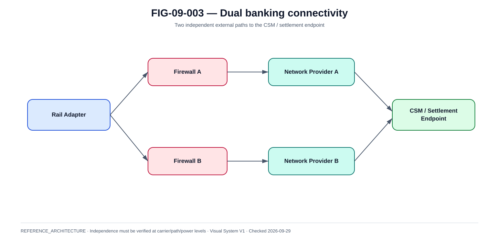

# Connectivité bancaire, dual links et chemins vers les CSM

La @fig-09-003 matérialise la vue de référence de ce chapitre.

{#fig-09-003}

*Statut : **REFERENCE_ARCHITECTURE** · Source(s) : Handbook reference architecture · Vérifié : 2026-09-29.*

## Le chemin externe financier est un service critique

La disponibilité applicative interne n'a aucune valeur si le PSP ne peut plus atteindre le rail/CSM.

## Topologie de référence

~~~text
Site / Region A
  ├─ Network Provider A
  └─ Network Provider B
        |
Banking Connectivity Zone
        |
  Rail/CSM endpoint(s)
        |
TIPS / RT1 / provider
~~~

## Dual connectivity

Dual links doivent être réellement indépendants.

Vérifier :

- carrier ;
- physical path ;
- router ;
- firewall ;
- power ;
- peering ;
- provider POP ;
- DNS ;
- certificate path.

Deux VLAN sur le même équipement ne constituent pas une vraie redondance.

## Active/active vs active/standby

### Active/active
Pros:

- capacity usage ;
- rapid failure tolerance.

Risks:

- ordering ;
- asymmetric routing ;
- duplicate sessions ;
- operational complexity.

### Active/standby
Pros:

- simpler behavior.

Risks:

- standby rot ;
- failover delay ;
- untested route.

## Session model

Document:

- persistent session ?
- reconnect semantics ?
- sequence state ?
- duplicate detection ?
- heartbeat ?
- idle timeout ?

A network reconnect must not create a second financial instruction.

## Provider dependency

If using a technical service provider:

- contract ;
- topology ;
- SLA/SLO ;
- incident contacts ;
- change notice ;
- audit rights ;
- DORA mapping ;
- exit.

## Firewall

Rules should be:

- destination-specific ;
- port-specific ;
- source-specific ;
- reviewed ;
- versioned.

No broad any-any for convenience.

## Proxy

If proxy is used:

- preserve mTLS semantics ;
- no unsafe retry ;
- connection pool sizing ;
- certificate chain ;
- timeout ;
- logging.

## Failover test

Inject:

- link A down ;
- provider A down ;
- router down ;
- firewall failure ;
- DNS wrong ;
- certificate invalid.

Measure:

- connection restoration ;
- in-flight payments ;
- UNKNOWNs ;
- duplicate count ;
- recovery.

## Maintenance

Planned maintenance still requires:

- alternate path validated ;
- freeze or traffic drain ;
- incident readiness ;
- rollback.

## Capacity

Links sized for:

- peak payment traffic ;
- status/inquiry ;
- burst after outage ;
- TLS overhead ;
- monitoring.

## Monitoring

Metrics:

- session state ;
- RTT ;
- packet loss ;
- reconnect ;
- throughput ;
- reject/error ;
- certificate expiry ;
- active path.

## Network vs business status

Network DOWN before submit:

- no effect.

Network breaks after submit:

- possible UNKNOWN.

This distinction must appear in runbooks.

## Disaster recovery

Site failover requires:

- alternate network path already provisioned ;
- certificates available ;
- firewall routes ;
- DNS/routing ;
- provider authorization.

A DR site without tested CSM connectivity is not a payment DR site.

## Evidence

Keep:

- topology ;
- path diversity ;
- failover timestamps ;
- session logs ;
- payment business results ;
- operator actions.
