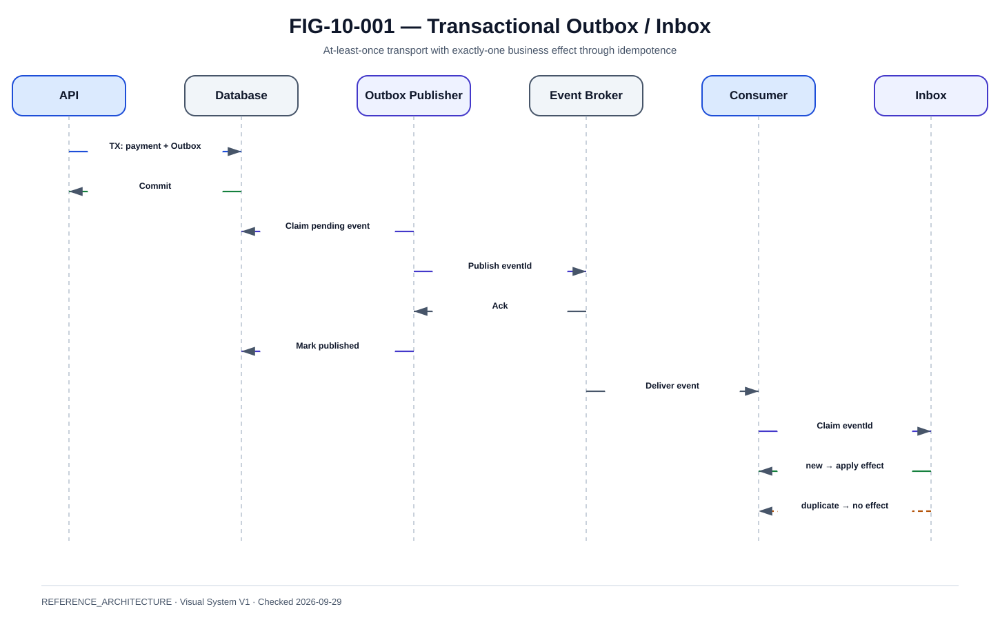

# Event-driven architecture, Outbox, Inbox, Kafka et MQ

La @fig-10-001 matérialise la vue de référence de ce chapitre.

{#fig-10-001}

*Statut : **REFERENCE_ARCHITECTURE** · Source(s) : Handbook reference architecture · Vérifié : 2026-09-29.*

## Event ≠ command

Event:

- fact that happened.

Command:

- request to perform action.

Do not publish PaymentSettled until authoritative settlement state exists.

## Event envelope

~~~json
{
  "eventId": "evt-001",
  "eventType": "PaymentSettled",
  "aggregateId": "pay-001",
  "aggregateVersion": 7,
  "occurredAt": "...",
  "correlationId": "...",
  "schemaVersion": 2,
  "payload": {}
}
~~~

## Transactional Outbox

Atomic transaction:
~~~text
update PAYMENT
insert OUTBOX
COMMIT
~~~

Publisher later:
~~~text
OUTBOX
→ broker
→ mark published
~~~

This prevents DB-success/broker-loss gap.

## Outbox worker

Needs:

- batching ;
- locking/claim ;
- SKIP LOCKED or equivalent ;
- retry ;
- poison handling ;
- lag metrics.

## Inbox

Consumer:

1. attempt insert eventId into INBOX ;
2. if exists, duplicate ;
3. if new, process effect ;
4. commit business state + INBOX.

## Kafka partitioning

Possible key:

- paymentId.

Benefits:

- ordering per payment ;
- horizontal scale.

Do not partition all payments on one key.

## MQ use cases

MQ remains relevant for:

- guaranteed enterprise messaging ;
- legacy/core integration ;
- request/reply where justified ;
- transactional patterns.

Kafka and MQ are not interchangeable slogans; choose by contract.

## Delivery semantics

At-least-once transport is compatible with exactly-one business effect if consumers are idempotent.

Never promise exactly-once financial settlement purely because a broker offers transaction features.

## Schema evolution

Rules:

- version envelope ;
- additive fields ;
- tolerant readers ;
- avoid changing meaning ;
- schema registry where appropriate.

## DLQ

DLQ entry includes:

- event ;
- error ;
- first/last failure ;
- attempts ;
- consumer version ;
- correlation.

DLQ replay requires business-safe check.

## Replay

Before replay:

- inspect current aggregate state ;
- verify event not already applied ;
- authorize operator ;
- scope subset ;
- observe impact.

## Broker outage

Outbox allows:

- payment DB commits ;
- secondary events wait ;
- publisher catches up after broker recovery.

Whether new payments continue depends on how critical downstream consumers are.

## Consumer outage

Broker retains backlog.

Monitor:

- lag ;
- age ;
- throughput ;
- storage ;
- recovery time.

## Event storms

Avoid event loop:

- consumer writes update ;
- emits event ;
- another consumer echoes back.

Define ownership and causal rules.

## Security

- TLS ;
- SASL/workload identity ;
- ACL per topic/queue ;
- encryption ;
- no secrets in payload ;
- data classification.

## Operations

Dashboards:

- broker health ;
- producer error ;
- outbox lag ;
- consumer lag ;
- DLQ ;
- duplicate rate ;
- replay actions.
