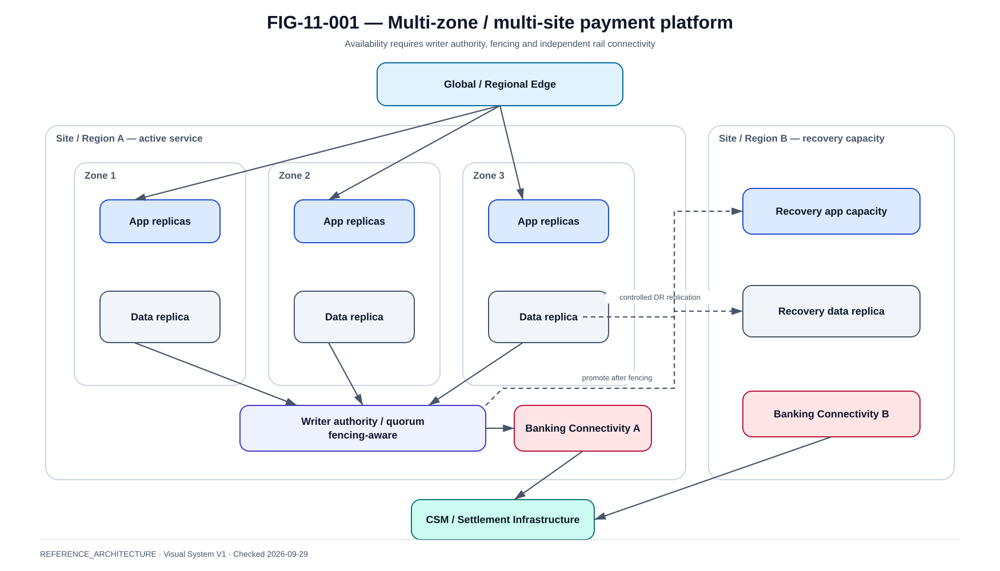

# Multi-AZ, multi-site et patterns DR

La @fig-11-001 matérialise la vue de référence de ce chapitre.

{#fig-11-001}

*Statut : **REFERENCE_ARCHITECTURE** · Source(s) : Handbook reference architecture · Vérifié : 2026-09-29.*

## Failure domains

~~~text
process
pod
node
rack
zone
site
region
provider
~~~

Chaque niveau demande une protection différente.

## Multi-node

Protège la perte d'un nœud seulement si :

- replicas distribuées ;
- storage disponible ;
- LB route ;
- dependencies survivantes.

## Multi-AZ

Exige :

- workers répartis ;
- DB quorum ;
- broker distribution ;
- ingress ;
- storage topology ;
- network ;
- IAM ;
- secrets/HSM access.

## Multi-site

Ajoute :

- WAN latency ;
- DNS/global routing ;
- data replication ;
- split brain ;
- operational ownership ;
- network providers.

## Active/passive

~~~text
Site A ACTIVE
Site B STANDBY
~~~

Nécessite :

- data replication ;
- regular failover test ;
- warm capacity ;
- promotion runbook ;
- fencing A before B.

## Active/active

Seulement si :

- ownership/sharding/consensus clair ;
- duplicate external effects prevented ;
- data model adapté.

Ne pas choisir pour prestige.

## Cell architecture

Partitionner le trafic en cellules :

- independent app/data slice ;
- blast-radius control ;
- known ownership.

## Global routing

Options :

- DNS ;
- global LB ;
- traffic manager.

Définir :

- health source ;
- TTL ;
- failover ;
- client cache behavior.

## Site loss

Le test doit inclure :

- perte réseau site ;
- promotion data ;
- route clients ;
- rail connectivity depuis DR ;
- certificates ;
- HSM ;
- reconciliation.

## External dependencies

Le site DR doit atteindre :

- CSM ;
- IAM ;
- fraud ;
- PKI/HSM ;
- observability ;
- third parties.

## Capacity in DR

Un standby sous-dimensionné peut ne pas tenir le pic.

Définir :

- minimum critical capacity ;
- scale-up time ;
- degraded mode.

## RTO decomposition

~~~text
detect
+ decide
+ fence
+ promote
+ route
+ warm
+ validate
+ reconcile
= business RTO
~~~

## RPO decomposition

Par classe de données :

- payment DB ;
- ledger ;
- event broker ;
- audit ;
- config.

## Failback

Étapes :

- stabilize ;
- resync ;
- prove consistency ;
- fence ;
- move traffic ;
- reconcile again.

## Evidence

Le diagramme n'est pas une preuve.

La preuve contient :

- exercise date ;
- failure injected ;
- measured times ;
- data validation ;
- payment outcomes ;
- unresolved gaps.
