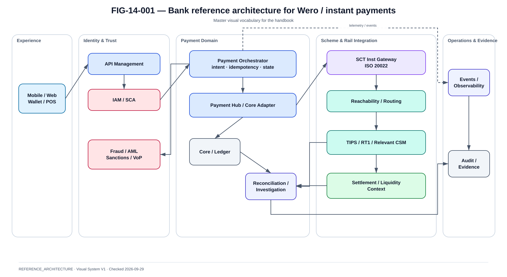

# Architecture de référence d'une banque connectée à Wero

La @fig-14-001 complète la lecture de ce chapitre avec la vue de référence correspondante.

{#fig-14-001}

*Statut : **REFERENCE_ARCHITECTURE** · Source(s) : Handbook reference architecture · Vérifié : 2026-09-29.*

## Vue d'ensemble

```text
Mobile / Web / Wero experience
        |
API Management
        |
Customer IAM / SCA
        |
Payment Orchestrator
        |
+------------------------------+
| Directory / VoP              |
| Fraud / Risk                 |
| AML / Sanctions              |
| Consent                      |
+------------------------------+
        |
Payment Hub / Core Adapter
        |
Core Account / Ledger
        |
SCT Inst Gateway
        |
Routing / CSM connectivity
        |
TIPS / RT1 / relevant route
        |
Beneficiary PSP
```

C'est une REFERENCE_ARCHITECTURE. Elle ne décrit aucune banque réelle.

## Channel

Responsibilities:

- collect intent ;
- display beneficiary ;
- display VoP result ;
- obtain consent ;
- invoke SCA ;
- show status.

Must not:

- infer settlement from UI redirect ;
- create a new payment on generic refresh.

## API Management

Capabilities:

- authentication enforcement ;
- quotas ;
- threat protection ;
- versioning ;
- routing ;
- observability.

A bank may expose separate APIs for:

- channel ;
- partner ;
- merchant ;
- internal services.

## Payment Orchestrator

Responsibilities:

- durable intent ;
- idempotency ;
- workflow ;
- state machine ;
- calls to risk/VoP ;
- payment execution ;
- external status inquiry ;
- reconciliation trigger.

## Fraud / AML / sanctions / VoP

Keep decisions separated even if a single orchestration layer invokes them.

A useful decision record contains:

- control type ;
- result ;
- reason ;
- model/rules version ;
- timestamp ;
- evidence reference.

## Payment Hub

A Payment Hub can abstract:

- scheme adapters ;
- canonical model ;
- validation ;
- routing ;
- exception processing ;
- operations.

But the book does not require a commercial product.

## Core Banking / account engine

Responsibilities can include:

- account existence ;
- balance ;
- reservation/debit ;
- ledger posting ;
- limits ;
- accounting.

Critical invariant:
financial execution and local state must have a recoverable relationship with the external rail effect.

## SCT Inst Gateway

Responsibilities:

- ISO 20022 generation/parsing ;
- scheme validation ;
- connection to CSM ;
- correlation ;
- timeout classification ;
- inquiry ;
- recall/return workflows.

## Routing

Inputs:

- reachability ;
- participant ;
- rail health ;
- liquidity ;
- contract ;
- policy.

The routing policy must be deterministic and auditable.

## Reconciliation

Sources:

- local payment store ;
- ledger ;
- CSM/rail reports/status ;
- settlement accounts ;
- events ;
- merchant records.

Outputs:

- matched ;
- missing local ;
- missing external ;
- amount mismatch ;
- status mismatch ;
- duplicate ;
- pending investigation.

## Legacy integration

Possible patterns:

### Direct integration
Payment Hub calls mainframe/core synchronously.

### MQ
Commands/events through enterprise messaging.

### Event interception
Core action emits event for downstream processing.

### API facade
Legacy capability exposed behind stable API.

### Strangler
New domains gradually replace legacy functions.

## Legacy-centric architecture

Characteristics:

- core owns most logic ;
- payment orchestration near core ;
- fewer distributed services.

Trade-offs:

- strong central control ;
- slower evolution ;
- coupling.

## Hybrid architecture

Characteristics:

- channels/API/cloud-native orchestration ;
- core remains system of record ;
- event/messaging integration.

Trade-offs:

- transitional complexity ;
- strong practical migration path.

## Cloud-native architecture

Characteristics:

- domain services ;
- container platform ;
- event-driven ;
- independently deployable components.

Trade-offs:

- distributed consistency ;
- operational complexity ;
- platform maturity required.

No model is universally “better”; context determines fit.

## Network view

```text
Internet
→ Edge/WAF
→ API zone
→ App zone
→ Payment zone
→ Core zone
→ Rail gateway zone
→ Banking network
→ CSM
```

## Security view

```text
Customer IAM
Workload IAM
PKI
HSM
Secrets
Fraud
VoP
AML/Sanctions
Audit
```

## Resilience view

Each critical dependency gets:

- failure domain ;
- redundancy ;
- recovery ;
- RTO ;
- RPO ;
- degraded mode ;
- test ;
- owner.

## Evidence view

Claims must be labelled:

- designed ;
- rendered/CI ;
- runtime-proven ;
- production-proven.

## Conclusion

A bank-side Wero architecture is fundamentally an integration between customer experience, payment orchestration, deterministic financial systems and external payment infrastructures.
