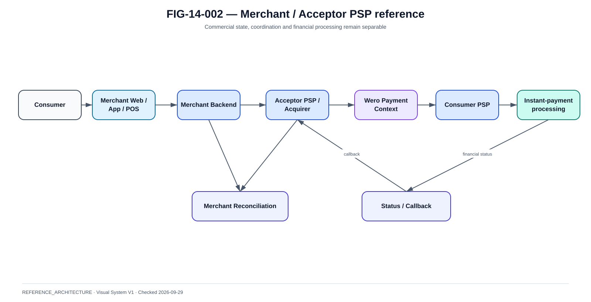

# Architecture de référence PSP / Acquéreur / Marchand

La @fig-14-002 complète la lecture de ce chapitre avec la vue de référence correspondante.

{#fig-14-002}

*Statut : **REFERENCE_ARCHITECTURE** · Source(s) : Handbook reference architecture · Vérifié : 2026-09-29.*

## Objectif

Le commerce ajoute une deuxième machine d'état : la commande.

```text
Order state
!= Payment state
!= Settlement state
```

## Vue de référence

```text
Customer
  |
Merchant Web/App/POS
  |
Merchant Backend
  |
Acceptor PSP / Acquirer
  |
Wero payment context
  |
Consumer PSP
  |
Instant-payment processing
  |
Beneficiary side
  |
Acceptor status / reconciliation
  |
Merchant Backend
```

## Merchant backend

Should own:

- order ;
- amount ;
- customer session ;
- paymentRequestId mapping ;
- commercial fulfilment ;
- refund request ;
- local audit.

Should not infer financial success from:

- browser redirect only ;
- QR scan only ;
- user screenshot.

## Acceptor PSP

Reference capabilities:

- merchant onboarding ;
- API credentials ;
- payment request ;
- checkout/QR context ;
- Wero integration ;
- callback ;
- status API ;
- refund ;
- merchant reconciliation ;
- reporting.

## Payment request

Conceptual model:

```text
paymentRequestId
merchantId
merchantOrderId
amount
currency
channelType
expiresAt
status
paymentId
callbackUrl/profile
```

## Channel types

- ECOMMERCE ;
- MCOMMERCE ;
- POS ;
- QR dynamic ;
- QR static where applicable.

The payment domain should not encode channel-specific UI logic into the financial core.

## Callback / webhook

Reference lifecycle:

```text
Payment final state
→ create callback event
→ sign
→ deliver
→ merchant 2xx
→ mark delivered
```

On failure:

- persist ;
- exponential/bounded retry ;
- deduplicate ;
- active merchant status query remains possible.

## Merchant status API

Critical fallback:
merchant can query by `paymentRequestId` or equivalent stable reference.

This protects against:

- lost callback ;
- merchant restart ;
- browser loss ;
- out-of-order notifications.

## Merchant reconciliation

Compare:

- orders ;
- payment requests ;
- payments ;
- refunds ;
- settlement/credit information ;
- fees if relevant.

Statuses:

- paid/order open ;
- order fulfilled/payment missing ;
- refund pending ;
- duplicate ;
- amount mismatch ;
- orphan payment.

## Refund

Merchant refund must be:

- authorised ;
- amount-limited ;
- idempotent ;
- auditable ;
- linked to original payment ;
- separately reconciled.

## Security

Merchant integration:

- API credentials/workload identity ;
- TLS/mTLS as contract requires ;
- webhook signature ;
- replay protection ;
- per-merchant scopes ;
- secret rotation ;
- rate limiting ;
- IP/network controls where useful.

## PCI DSS boundary

Wero account-to-account flows are distinct from card payment flows.

A merchant environment can still be in PCI DSS scope because it also accepts cards. The architecture must draw the boundaries rather than assume “Wero removes all PCI concerns”.

## Availability dependency

The merchant checkout depends on:

- merchant backend ;
- Acceptor PSP ;
- Wero service ;
- Consumer PSP ;
- payment rail ;
- beneficiary side ;
- callback/status.

A failure anywhere changes UX and recovery.

## Degraded modes

Possible:

- callback delayed, status API available ;
- reporting delayed ;
- refund temporarily queued.

Not acceptable:

- mark order paid from redirect alone ;
- issue goods on UNKNOWN without business policy ;
- retry payment request as a new financial payment blindly.

## Merchant SLOs

Examples:

- create payment request availability ;
- QR generation latency ;
- callback delivery latency ;
- status API availability ;
- refund processing ;
- reconciliation freshness.

## POS specifics

POS must handle:

- terminal timeout ;
- customer wallet delay ;
- cashier retry ;
- duplicate scan ;
- cancelled basket ;
- receipt.

The POS should query authoritative backend status before asking the customer to pay again.

## Support tooling

Operations screen should show:

- order ;
- payment request ;
- payment ;
- status history ;
- callbacks ;
- refund ;
- reconciliation ;
- support notes ;
- evidence.

## Conclusion

The merchant architecture succeeds when commercial state and financial state can diverge temporarily without creating duplicate charges or false fulfilment.
