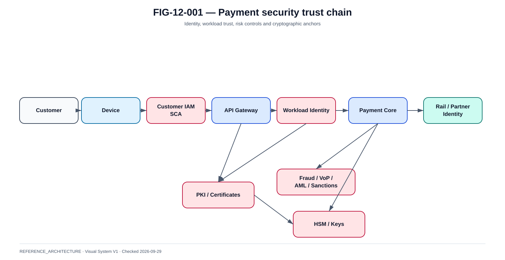

# Partie XI — Sécurité, identité, fraude et Verification of Payee

La @fig-12-001 matérialise la vue de référence de ce chapitre.

{#fig-12-001}

*Statut : **REFERENCE_ARCHITECTURE** · Source(s) : Handbook reference architecture · Vérifié : 2026-09-29.*

## Trust chain

La sécurité d'un paiement traverse :

- client ;
- device ;
- canal ;
- identité ;
- workload ;
- opérateur ;
- partenaire ;
- réseau ;
- clé cryptographique ;
- données ;
- transaction.

Zero Trust signifie vérifier identité, droit et contexte à chaque frontière pertinente.

## Customer IAM

Capabilities :

- enrollment ;
- authentication ;
- account/wallet binding ;
- device registration ;
- recovery ;
- session ;
- risk signals.

Identity proofing et authentification continue sont deux problèmes différents.

## SCA

Strong Customer Authentication doit être pensée comme capability de sécurité et de conformité sous le cadre juridique applicable.

Sujets :

- indépendance des facteurs ;
- transaction binding/dynamic linking lorsque applicable ;
- biométrie locale vs preuve serveur ;
- exemptions ;
- audit ;
- fallback ;
- risk assessment.

Face ID seul n'est pas “l'architecture SCA”.

## OAuth2 / OIDC

OIDC :

- authentication/federation.

OAuth2 :

- authorization d'API.

Reference service-to-service :

- client credentials ou workload federation ;
- scopes minimaux ;
- audience ;
- token court ;
- rotation/identity lifecycle.

## Workload identity

Éviter les comptes techniques partagés.

Préférer :

- platform identities ;
- federation ;
- short-lived token ;
- certificate identity ;
- per-service scopes.

## TLS / mTLS

TLS protège le transport. mTLS ajoute l'authentification mutuelle.

Questions :

- CA ?
- cert ownership ?
- rotation ?
- overlap ?
- expiry monitoring ?
- revocation ?
- emergency procedure ?

## PKI

Inventaire :

- root CA ;
- intermediates ;
- endpoint certs ;
- client certs ;
- signing certs ;
- trust stores ;
- CRL/OCSP dependencies.

La PKI est une dépendance de disponibilité.

## HSM

Use cases :

- private-key protection ;
- signature ;
- crypto ;
- payment/security key operations selon architecture.

Controls :

- dual control ;
- key ceremony ;
- partitions ;
- backup ;
- rotation ;
- audit ;
- HA ;
- DR.

## Secrets management

Principes :

- aucun secret plaintext dans Git ;
- rotation ;
- short-lived lorsque possible ;
- per-service ;
- audit ;
- break-glass ;
- revocation.

## Fraud, AML, sanctions et VoP

Ils ne sont pas synonymes.

~~~text
Fraud
= comportement transactionnel suspect

AML/CFT
= risque blanchiment / financement du terrorisme

Sanctions
= parties ou restrictions réglementaires

VoP
= vérification du couple payee name / account identifier
~~~

## Verification of Payee

Le rulebook EPC VoP version 1.1 est effectif depuis le 20 septembre 2026.

Modèle public :

1. le payer fournit le bénéficiaire ;
2. le Requesting PSP envoie une demande ;
3. le Responding PSP compare avec ses données ;
4. une réponse revient ;
5. le résultat est présenté au payer.

Les catégories de réponse du scheme incluent notamment des notions de match, no match, close match ou check not possible selon les spécifications applicables.

## Architecture VoP de référence

~~~text
Channel
  |
Payment initiation
  |
VoP Client
  |
VoP Scheme / routing
  |
Payee PSP
  |
Matching Engine
  |
Response
  |
Payer decision / continuation
~~~

## VoP failure policy

Cas :

- timeout ;
- unavailable ;
- payee unreachable ;
- malformed response ;
- close match ;
- no match.

Le comportement UI/paiement doit suivre les règles juridiques et scheme applicables. Le livre n'invente pas une politique universelle block/allow.

## Fraud architecture

Signaux :

- device ;
- identity ;
- velocity ;
- behavior ;
- beneficiary ;
- amount ;
- context ;
- graph ;
- merchant ;
- historical risk.

Décisions de référence :

- ALLOW ;
- CHALLENGE ;
- REVIEW ;
- BLOCK.

L'exécution financière reste déterministe.

## APP fraud

Authorised Push Payment fraud est particulier : le vrai client peut authentifier un paiement frauduleux.

Contrôles :

- VoP ;
- warnings ;
- anomaly detection ;
- beneficiary reputation ;
- transaction limits ;
- intervention ;
- intelligence post-event.

## QR threats

In-store/e-commerce QR :

- substitution ;
- phishing ;
- stale/expired request ;
- malicious deep link ;
- wrong merchant ;
- amount alteration.

Controls :

- signed/opaque context ;
- merchant identity displayed in wallet ;
- amount confirmation ;
- expiry ;
- one-time token when dynamic ;
- domain/app link verification.

## Webhook security

Webhook marchand :

- TLS ;
- HMAC/signature or mTLS according to contract ;
- timestamp ;
- replay protection ;
- eventId dedup ;
- retry ;
- endpoint rotation ;
- allowlist where useful.

A successful signature does not itself prove financial finality; it proves message authenticity under the integration contract.

## GDPR / data minimisation

Payment data can include :

- IBAN/account refs ;
- phone/email alias ;
- merchant ;
- device ;
- IP ;
- location ;
- history ;
- fraud signals.

Architecture :

- purpose limitation ;
- minimisation ;
- access controls ;
- retention ;
- pseudonymisation where useful ;
- subject rights processes ;
- breach response.

## Threat model

Payment-specific threats:

- duplicate payment ;
- forged callback ;
- account takeover ;
- QR substitution ;
- payee manipulation ;
- replay ;
- credential theft ;
- settlement-status spoof ;
- operator fraud ;
- key compromise ;
- supply-chain compromise ;
- insider abuse.

## Security logging

Audit events:

- auth ;
- SCA ;
- consent ;
- VoP ;
- fraud decision ;
- payment creation ;
- submit ;
- state transitions ;
- operator action ;
- key/cert rotation ;
- callback ;
- reconciliation.

Do not log secrets or unnecessary personal data.

## Incident containment

Example :

~~~text
credential compromise suspected
→ block identity
→ isolate workload
→ preserve evidence
→ identify potentially submitted payments
→ authoritative inquiry / reconciliation
→ rotate credentials
→ restore service
~~~

Une réponse cyber doit préserver la vérité paiement.

## PSD3 / PSR status

Au 28 septembre 2026 :

- accord politique provisoire Parlement/Conseil obtenu le 27 novembre 2025 ;
- le livre ne présente pas PSD3/PSR comme pleinement applicables sans revalidation des textes finaux et dates.

Cette discipline évite de publier une réglementation “future” comme déjà en vigueur.

## eIDAS2

Le cadre européen d'identité numérique est pertinent comme contexte pour de futures intégrations d'identité/wallet.

Aucune utilisation spécifique par Wero n'est affirmée sans source.

## NIS2

NIS2 apporte un contexte cybersécurité européen. Pour les entités financières soumises à DORA, l'articulation juridique exacte doit être traitée avec la règle lex specialis et l'analyse de périmètre appropriée.

Le livre ne formule pas d'avis juridique individuel.

## Security evidence

Un claim de sécurité doit être relié à :

- config ;
- test positif ;
- test négatif ;
- logs ;
- rotation/revocation ;
- ownership ;
- runbook.

“mTLS configuré” sans test de refus d'un mauvais client reste une preuve incomplète.

## Conclusion

La sécurité instant-payment est une chaîne de confiance. Une faiblesse dans l'identité, la PKI, le QR, le webhook, le réseau ou la récupération d'incident peut compromettre un parcours pourtant fonctionnellement correct.
