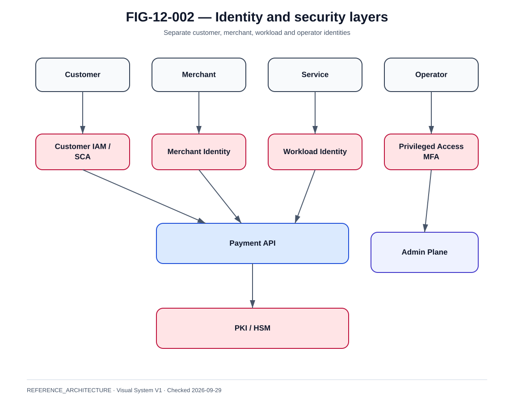

# IAM client, workload identity et SCA

La @fig-12-002 matérialise la vue de référence de ce chapitre.

{#fig-12-002}

*Statut : **REFERENCE_ARCHITECTURE** · Source(s) : Handbook reference architecture · Vérifié : 2026-09-29.*

## Quatre identités différentes

- customer identity ;
- merchant identity ;
- workload identity ;
- operator identity.

Les fusionner dans un même modèle d'autorisation crée des privilèges excessifs.

## Customer IAM

Capabilities :

- login ;
- MFA/SCA integration ;
- device relation ;
- session ;
- recovery ;
- consent context.

## Authentication vs authorization

Authentication:
who are you?

Authorization:
what may you do?

Payment approval adds:
what transaction are you consenting to?

## SCA

Le design doit supporter :

- facteurs ;
- exemptions lorsque cadre applicable ;
- challenge ;
- consent ;
- evidence ;
- failure/retry.

SCA success does not equal settlement success.

## Session

Controls:

- short idle timeout appropriate to UX ;
- secure cookie/token ;
- device binding if policy ;
- re-auth for sensitive action ;
- logout/revocation.

## OAuth2

Reference:

- authorization server ;
- resource server ;
- client ;
- scopes ;
- audience.

Use short-lived access tokens and explicit audiences.

## OIDC

Provides identity layer:

- issuer ;
- subject ;
- claims ;
- ID token.

Do not send ID token to APIs as generic access token unless designed.

## Workload identity

Prefer:

- service account ;
- short-lived token ;
- certificate ;
- workload-bound identity.

Avoid shared static API keys.

## Operator IAM

Privileged actions:

- payment correction ;
- replay ;
- liquidity ;
- cert/key operations ;
- config.

Require:

- MFA ;
- least privilege ;
- PAM where applicable ;
- approval ;
- audit.

## Token validation

Check:

- signature ;
- issuer ;
- audience ;
- expiry ;
- not-before ;
- scopes ;
- key version.

## JWKS/key rotation

Cache keys but:

- refresh safely ;
- handle overlap ;
- alert unknown kid ;
- no long outage on rotation.

## IAM outage

Design choices:

- existing valid token can continue if validation local ;
- new login may fail ;
- revocation freshness trade-off.

Document degraded mode.

## Account recovery

High-risk flow:

- identity proof ;
- fraud ;
- SIM swap ;
- email compromise.

Recovery must not bypass payment protections.

## Separation of duties

No single operator should be able to:

- change security policy ;
- execute financial correction ;
- hide audit.

## Evidence

Store authentication/payment consent evidence according to legal/policy needs without excessive sensitive retention.
