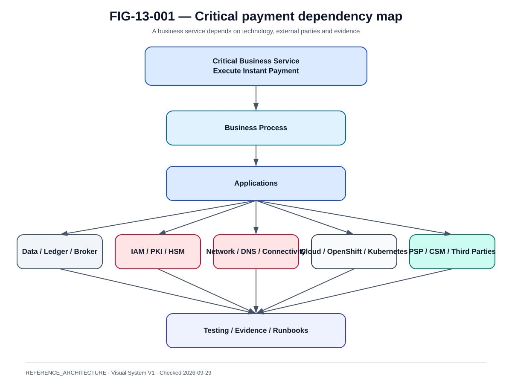
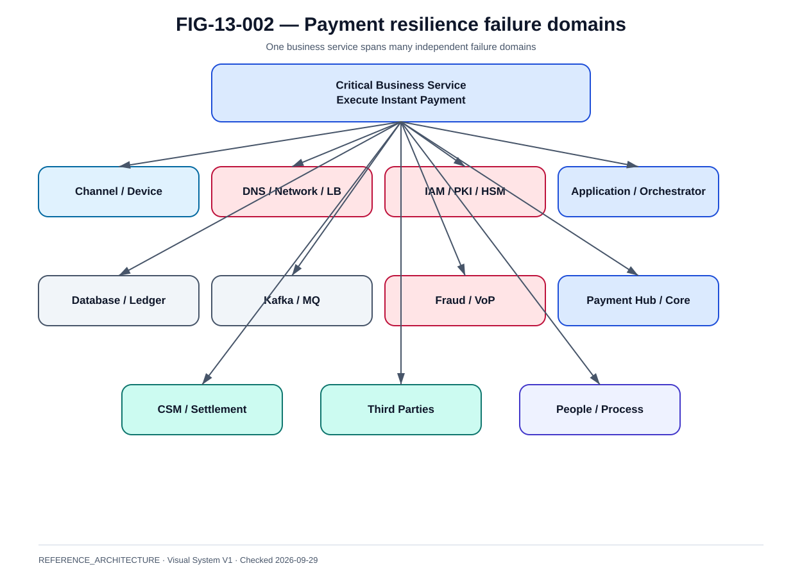

# BIA, services critiques, RTO et RPO

La @fig-13-001 complète la lecture de ce chapitre avec la vue de référence correspondante.

{#fig-13-001}

*Statut : **REFERENCE_ARCHITECTURE** · Source(s) : Handbook reference architecture · Vérifié : 2026-09-29.*

La @fig-13-002 complète la lecture de ce chapitre avec la vue de référence correspondante.

{#fig-13-002}

*Statut : **REFERENCE_ARCHITECTURE** · Source(s) : Handbook reference architecture · Vérifié : 2026-09-29.*

## Partir du service métier

Le bon point de départ n'est pas le pod, le serveur ou la VM.

Service :

- payer un particulier ;
- payer un marchand ;
- rembourser ;
- consulter le statut ;
- réconcilier.

## Critical business service

Exemple :

~~~text
Execute Instant Payment
├─ Channel
├─ IAM / SCA
├─ Fraud / VoP
├─ Payment Orchestrator
├─ Payment Hub
├─ Core / Ledger
├─ DB
├─ Broker
├─ Network
├─ PKI / HSM
├─ Rail / CSM
└─ Settlement / Liquidity
~~~

## BIA

For each service:

- customer impact ;
- financial impact ;
- regulatory impact ;
- operational impact ;
- reputational impact ;
- acceptable disruption ;
- peak period sensitivity.

## RTO

RTO is time to restore useful business service.

Not:

- pod started ;
- VM booted ;
- DNS switched.

Service restored when:

- new payments safely accepted if in scope ;
- status/inquiry works ;
- financial path works ;
- operators can reconcile.

## RPO

RPO applies to a dataset and failure domain.

Examples:

- payment state ;
- ledger ;
- event stream ;
- audit ;
- configuration.

## MTPD / tolerance

BIA may define maximum tolerable disruption broader than technical RTO.

Architecture targets must align with business tolerance.

## Dependency RTO

If payment RTO = 5 min but HSM supplier RTO = 4h:

- target is incoherent.

Dependency mapping exposes impossible objectives.

## Peak criticality

Same outage at:

- Sunday 03:00 ;
- Black Friday 18:00
can have different impact.

RTO target may stay same, but capacity/recovery evidence must include peak.

## Data classification

RPO priorities:

- acknowledged financial writes ;
- settlement references ;
- idempotency claims ;
- audit ;
- analytics.

Not all data need same RPO.

## External financial truth

Even with local RPO=0:

- external settlement may occur before local state persisted.

Therefore recovery includes inquiry/reconciliation.

## BIA matrix

| Service | Impact | Target RTO | Data RPO | Critical dependencies |
|---|---|---|---|---|
| Payment execution | severe | business-approved | financial-specific | IAM, core, rail, network |
| Status inquiry | high | business-approved | replicated state | DB, rail inquiry |
| Merchant webhook | medium/high | business-approved | delivery records | broker, notification |
| Reporting | lower immediate | business-approved | reporting-specific | data platform |

No production values invented.

## Recovery priority

Priority can be:

1. financial truth/status ;
2. payment execution ;
3. merchant notification ;
4. secondary reporting.

Based on BIA.

## Evidence

For each target:

- design ;
- test ;
- measured ;
- date ;
- limitations.

## DORA alignment

DORA requires an ICT risk framework and operational resilience discipline. BIA/dependency mapping supports architecture evidence but does not alone prove compliance.

## Review cadence

Revisit when:

- new Wero use case ;
- new CSM/provider ;
- major architecture change ;
- acquisition/migration ;
- incident reveals hidden dependency.
