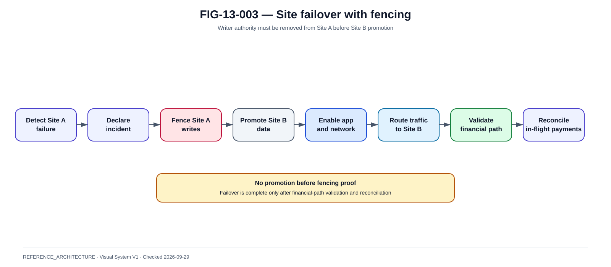

# Active/passive, active/active, fencing et split-brain

La @fig-13-003 complète la lecture de ce chapitre avec la vue de référence correspondante.

{#fig-13-003}

*Statut : **REFERENCE_ARCHITECTURE** · Source(s) : Handbook reference architecture · Vérifié : 2026-09-29.*

## Availability is not correctness

Deux sites actifs peuvent augmenter disponibilité tout en augmentant le risque de double effet.

## Active/passive

~~~text
Site A ACTIVE
  |
replication
  |
Site B STANDBY
~~~

Advantages:

- single writer ;
- simpler consistency.

Risks:

- standby untested ;
- promotion delay ;
- stale config ;
- failback.

## Hot vs warm standby

Hot:

- services running ;
- data near-current ;
- quick promotion.

Warm:

- partial capacity ;
- startup/scale required.

Document exact state.

## Active/active

Possible models:

- shared consensus datastore ;
- sharded ownership ;
- cell-based ;
- region affinity.

Avoid uncontrolled dual writer.

## Split brain

Scenario:

- A cannot see B ;
- both think other failed ;
- both accept same logical payment.

Outcome can be catastrophic.

## Fencing

Before promoting B:

- ensure A cannot write.

Mechanisms:

- consensus lease ;
- DB quorum ;
- storage fencing ;
- network isolation ;
- cloud/provider fencing ;
- manual isolation with proof.

## Quorum

Place quorum so no simple network partition creates two majorities.

Understand:

- node count ;
- zone placement ;
- witness ;
- latency.

## External side effects

Even if internal DB uses consensus, two workers may still call external rail twice unless submission ownership is fenced.

Use:

- durable claim ;
- state version ;
- unique logical submission ;
- idempotency.

## Traffic fencing

Global LB/DNS must not send new writes to old site after promotion.

Need:

- health source ;
- TTL ;
- drain ;
- session handling.

## Operator split brain

Two incident teams can take conflicting actions.

Define:

- incident commander ;
- promotion authority ;
- runbook ;
- communication channel.

## Failover sequence

~~~text
detect
→ declare incident
→ freeze/limit writes if needed
→ fence old writer
→ promote data
→ enable app
→ route traffic
→ validate rail
→ reconcile
→ reopen full service
~~~

## Failback

Not immediate.

Need:

- root cause fixed ;
- data resynced ;
- old site trustworthy ;
- planned window ;
- second fencing event.

## Testing

- clean failover ;
- network partition ;
- stale standby ;
- old writer returns ;
- DNS lag ;
- operator duplicate promotion ;
- external submit during switchover.

## Metrics

- detection ;
- fencing time ;
- promotion ;
- traffic switch ;
- first successful payment ;
- reconciliation completion.

## Design rule

If the architecture cannot explain exactly who owns write authority during every partition, it is not ready for active/active financial processing.
